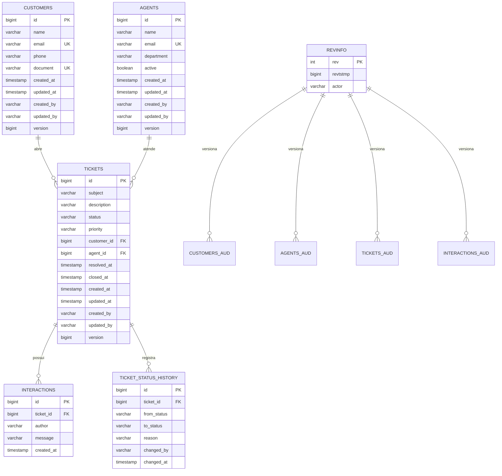
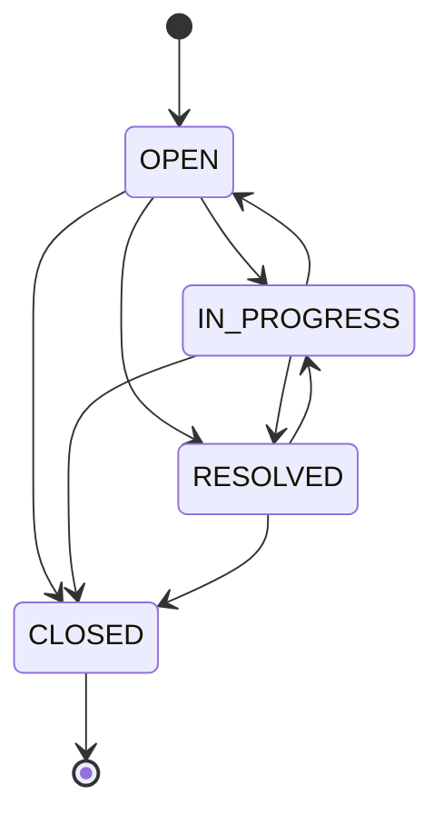

# CRM de Customer Service — Monólito Spring Boot + React (Next.js)

Aplicação de atendimento ao cliente (CRM) desenvolvida como monólito simples
com **Spring Boot** (back-end) e **Next.js/React** (front-end), organizada em
camadas (controller/service/repository) e por bounded contexts de
Domain-Driven Design (Customer, Agent, Ticket).

A **Etapa 2 (branch `TP2`)**, que introduz a camada de persistência real com
JPA, Spring Data e histórico de dados, está documentada integralmente na seção
[Camada de persistência (Etapa 2)](#camada-de-persistência-etapa-2) deste
README.

## Stack

| Camada | Tecnologia |
|---|---|
| Back-end | Java 21, Spring Boot 3.3 (Web, Data JPA, Validation), Spring Data Envers, Hibernate Envers, H2 (arquivo), Maven |
| Front-end | Next.js 16 (App Router), React 18, JavaScript |
| Testes | JUnit 5, Spring Boot Test (`@DataJpaTest`, `@SpringBootTest`, MockMvc), AssertJ |
| Documentação | Markdown + diagramas Mermaid |

## Estrutura do repositório

```
crm-customer-service/
├── backend/     # API REST Spring Boot (monólito, camadas + bounded contexts)
│   ├── data/    # banco H2 em arquivo (gerado em runtime, ignorado pelo Git)
│   └── src/main/java/com/pb/crm/
│       ├── audit/      # AuditableEntity, entidade de revisão Envers, DTO de revisão
│       ├── config/     # PersistenceConfig (JPA Auditing + Envers), RequestActor, DataSeeder
│       ├── common/     # exceções, handler global, paginação, CORS
│       ├── customer/   # bounded context Cliente
│       ├── agent/      # bounded context Atendente
│       └── ticket/     # bounded context Ticket (agregado com interações e histórico)
└── frontend/    # Aplicação React (Next.js) que consome a API
```

## Pré-requisitos

- **Java 21+** (JDK) — para o back-end
- **IntelliJ IDEA** — para abrir e rodar o back-end (detecta o Maven
  automaticamente via `backend/pom.xml`)
- **Node.js 18+** e **npm** — para o front-end

Não é necessário instalar o Maven manualmente: o projeto inclui o **Maven
Wrapper** (`backend/mvnw` / `backend/mvnw.cmd`), e o IntelliJ também traz um
Maven embutido.

## Como executar

### 1. Back-end (porta 8080)

Abra a pasta `backend/` no IntelliJ como projeto Maven (ele será detectado
automaticamente pelo `pom.xml`) e rode a classe
`com.pb.crm.CrmCustomerServiceApplication` (botão ▶ ao lado do `main`).

Alternativamente, via terminal:

```bash
cd backend
./mvnw spring-boot:run        # Linux/macOS
mvnw.cmd spring-boot:run      # Windows
```

A API sobe em `http://localhost:8080`.

O banco H2 é criado em **`backend/data/crmdb.mv.db`** na primeira execução e
os dados **persistem entre reinícios**. Na primeira subida (banco vazio) o
`DataSeeder` carrega clientes, atendentes e tickets de exemplo, já com
histórico de status e revisões. Para começar do zero, pare a aplicação e apague
a pasta `backend/data/`. Para subir sem carga inicial, use
`app.seed.enabled=false`.

Console H2: `http://localhost:8080/h2-console` (JDBC URL
`jdbc:h2:file:./data/crmdb`, usuário `sa`, sem senha). Além das tabelas de
negócio, é possível inspecionar as tabelas de auditoria `*_AUD`, `REVINFO` e
`TICKET_STATUS_HISTORY`.

> **Windows:** a aplicação define `jdk.net.unixdomain.tmpdir` para
> `%SystemRoot%\Temp` ao iniciar, contornando uma falha do JDK ao abrir o
> loopback do NIO em alguns perfis de usuário ("Unable to establish loopback
> connection"). Se preferir, defina a propriedade nas opções de VM do IntelliJ.

#### Endpoints

Cabeçalho opcional em qualquer requisição: `X-Actor: <nome>` — identifica quem
está operando; é gravado em `created_by`/`updated_by`, no histórico de status e
nas revisões Envers (padrão: `system`).

| Recurso | Endpoints |
|---|---|
| Clientes | `GET/POST /api/customers`, `GET/PUT/DELETE /api/customers/{id}`, `GET /api/customers/search?q=&page=&size=&sort=`, `GET /api/customers/{id}/revisions` |
| Atendentes | `GET/POST /api/agents` (`?active=true`), `GET/PUT/DELETE /api/agents/{id}`, `GET /api/agents/{id}/revisions` |
| Tickets | `GET /api/tickets` (`?status=&customerId=`), `POST /api/tickets`, `GET/PUT/DELETE /api/tickets/{id}`, `PATCH /api/tickets/{id}/status` (`{"status","reason"}`), `POST /api/tickets/{id}/interactions` |
| Consultas de tickets | `GET /api/tickets/search?status=&priority=&customerId=&agentId=&subject=&createdFrom=&createdTo=&page=&size=&sort=`, `GET /api/tickets/stats` |
| Histórico | `GET /api/tickets/{id}/status-history`, `GET /api/tickets/{id}/revisions` |

Respostas de erro: `404` (não encontrado), `400` (validação/parâmetro
inválido), `409` (regra de negócio, duplicidade, vínculo de integridade ou
conflito de versão).

Exemplo com `curl`:

```bash
curl -X PATCH http://localhost:8080/api/tickets/1/status \
  -H "Content-Type: application/json" -H "X-Actor: maria" \
  -d '{"status":"RESOLVED","reason":"cliente confirmou a solucao"}'

curl http://localhost:8080/api/tickets/1/status-history
curl http://localhost:8080/api/tickets/1/revisions
```

### 2. Front-end (porta 3000)

```bash
cd frontend
npm install
npm run dev
```

Acesse `http://localhost:3000`. O front-end espera o back-end em
`http://localhost:8080/api` (configurável via `NEXT_PUBLIC_API_URL`, veja
`frontend/.env.local.example`). O nome enviado no cabeçalho `X-Actor` pode ser
alterado com `NEXT_PUBLIC_ACTOR`.

A página de detalhe do ticket exibe, além das interações, a **linha do tempo
de status** e as **revisões de auditoria** do ticket.

> Rode o back-end **antes** do front-end para que o dashboard e as listagens
> carreguem os dados corretamente.

### 3. Testes do back-end

```bash
cd backend
./mvnw test          # Linux/macOS
mvnw.cmd test        # Windows
```

Os testes usam o perfil `test` (H2 em memória) e cobrem repositórios,
auditoria/Envers, lock otimista, regras do agregado e a API REST. Detalhes na
seção [Testes automatizados](#testes-automatizados).

---

## Camada de persistência (Etapa 2)

Esta seção descreve o design da camada de persistência do CRM, construída com
**JPA (Hibernate 6.5)**, **Spring Data JPA**, **Spring Data Envers** e
**Hibernate Envers** sobre **H2** em modo arquivo. Cobre: modelo de dados,
decisões de mapeamento, repositórios e exemplos de uso, gerenciamento de
transações/integridade/performance, histórico de mudanças (auditoria) e a
estratégia de testes.

### Visão geral

```
┌────────────────────────────────────────────────────────────────────────┐
│  Controllers (REST)  →  Services (@Transactional)  →  Repositories     │
│                                                          │             │
│                       Spring Data JPA + Envers ──────────┤             │
│                                                          ▼             │
│                       Hibernate ORM (JPA)  ──►  H2 (./data/crmdb)      │
│                          │                                             │
│                          ├─ AuditingEntityListener (created/updated)   │
│                          └─ Envers (tabelas *_aud + revinfo)           │
└────────────────────────────────────────────────────────────────────────┘
```

Princípios adotados:

| Princípio | Como foi aplicado |
|---|---|
| Isolamento de domínio | Um pacote por bounded context (`customer`, `agent`, `ticket`), cada um com entidade, repositório, serviço, controller e DTOs. Apenas o contexto de **Ticket** referencia os outros dois, e somente para leitura (associações `@ManyToOne`), nunca para alterá-los. |
| Modelagem orientada à consulta | Índices declarados para os filtros mais usados (`status`, `priority+status`, `customer_id`, `agent_id`, `created_at`), `@EntityGraph` e `join fetch` para evitar N+1, projeções para agregações. |
| Integridade | Chaves estrangeiras nomeadas, `unique constraints`, `@Version` (lock otimista), regras de transição de status no agregado `Ticket`, exceções traduzidas para HTTP 409. |
| Rastreabilidade | Dois níveis de histórico: **Envers** (foto de cada entidade a cada transação) e **`ticket_status_history`** (linha do tempo de status do ticket, legível para o negócio). |


### Modelo de dados

#### Diagrama entidade-relacionamento



#### Entidades e anotações JPA utilizadas

| Entidade | Tabela | Principais anotações |
|---|---|---|
| `AuditableEntity` (`@MappedSuperclass`) | — | `@CreatedDate`, `@LastModifiedDate`, `@CreatedBy`, `@LastModifiedBy`, `@Version`, `@EntityListeners(AuditingEntityListener)` |
| `Customer` | `customers` | `@Entity`, `@Table(uniqueConstraints, indexes)`, `@SequenceGenerator`, `@Audited`, `@AuditOverride` |
| `Agent` | `agents` | idem, índices em `department` e `active` |
| `Ticket` (raiz de agregado) | `tickets` | `@ManyToOne(LAZY)` para `Customer` e `Agent` com `@JoinColumn(foreignKey)`, `@OneToMany(mappedBy, cascade = ALL, orphanRemoval = true)` para interações e histórico, `@Enumerated(STRING)`, `@OrderBy`, `@NotAudited` na coleção de histórico |
| `Interaction` | `interactions` | `@ManyToOne(LAZY, optional = false)`, `@CreatedDate`, `@Audited` |
| `TicketStatusHistory` | `ticket_status_history` | `@ManyToOne(LAZY)`, `@CreatedBy`, `@CreatedDate`, índices por ticket e por status destino |
| `CrmRevisionEntity` | `revinfo` | `@RevisionEntity(CrmRevisionListener)`, `@RevisionNumber`, `@RevisionTimestamp`, coluna extra `actor` |

Decisões de mapeamento:

* **Geração de IDs por sequência** (`allocationSize = 50`): permite ao Hibernate
  reservar blocos de IDs e usar *batch inserts* (`hibernate.jdbc.batch_size=20`,
  `order_inserts/order_updates`), o que não é possível com `IDENTITY`.
* **Associações LAZY em todas as `@ManyToOne`**: o carregamento é decidido por
  consulta (`@EntityGraph`, `join fetch`, Specification com `fetch`), nunca
  implicitamente. `hibernate.default_batch_fetch_size=20` atua como rede de
  segurança contra N+1 em caminhos não otimizados.
* **`spring.jpa.open-in-view=false`**: sessões abertas apenas dentro das
  transações dos serviços; DTOs são montados dentro da transação.
* **Normalização no domínio**: e-mail em minúsculas e campos vazios convertidos
  para `null` dentro das entidades, garantindo que as *unique constraints*
  (`uk_customers_email`, `uk_customers_document`, `uk_agents_email`) tenham
  efeito e que vários clientes possam existir sem documento.
* **Agregado `Ticket`**: `Interaction` e `TicketStatusHistory` só existem por
  meio do ticket (`cascade = ALL`, `orphanRemoval = true`) e seus construtores
  são *package-private*; toda mudança de estado passa por métodos do agregado
  (`changeStatus`, `addInteraction`, `update`), que aplicam as regras de negócio.

#### Máquina de estados do ticket



* `TicketStatus.canTransitionTo` define as transições permitidas; transições
  inválidas ou repetidas lançam `BusinessRuleException` (HTTP 409).
* `RESOLVED` preenche `resolved_at`; `CLOSED` preenche `closed_at`; reabrir
  limpa ambos.
* Ticket `CLOSED` é terminal: não aceita edição nem novas interações.
* Cada transição gera uma linha em `ticket_status_history` (com `from`, `to`,
  `reason`, `changed_by`, `changed_at`), inclusive a abertura (`null → OPEN`).


### Repositórios Spring Data

Todos os repositórios estendem `JpaRepository`; os das entidades auditadas
também estendem `RevisionRepository<T, Long, Integer>` (Spring Data Envers),
habilitado por `EnversRevisionRepositoryFactoryBean` em `PersistenceConfig`.

#### `CustomerRepository`

```java
public interface CustomerRepository extends JpaRepository<Customer, Long>,
        RevisionRepository<Customer, Long, Integer> {

    Optional<Customer> findByEmailIgnoreCase(String email);
    boolean existsByEmailIgnoreCase(String email);
    boolean existsByEmailIgnoreCaseAndIdNot(String email, Long id);
    boolean existsByDocument(String document);
    boolean existsByDocumentAndIdNot(String document, Long id);
    List<Customer> findAllByOrderByNameAsc();
    Page<Customer> findByNameContainingIgnoreCase(String name, Pageable pageable);

    @Query("""
            select c from Customer c
            where lower(c.name) like lower(concat('%', :term, '%'))
               or lower(c.email) like lower(concat('%', :term, '%'))
               or c.document = :term
            """)
    Page<Customer> search(@Param("term") String term, Pageable pageable);
}
```

#### `AgentRepository`

```java
public interface AgentRepository extends JpaRepository<Agent, Long>,
        RevisionRepository<Agent, Long, Integer> {

    boolean existsByEmailIgnoreCase(String email);
    boolean existsByEmailIgnoreCaseAndIdNot(String email, Long id);
    List<Agent> findAllByOrderByNameAsc();
    List<Agent> findByActiveTrueOrderByNameAsc();
    List<Agent> findByDepartmentIgnoreCaseOrderByNameAsc(String department);
    long countByActiveTrue();
}
```

#### `TicketRepository`

```java
public interface TicketRepository extends JpaRepository<Ticket, Long>,
        JpaSpecificationExecutor<Ticket>,
        RevisionRepository<Ticket, Long, Integer> {

    @EntityGraph(attributePaths = {"customer", "agent"})
    List<Ticket> findAllByOrderByCreatedAtDesc();

    @EntityGraph(attributePaths = {"customer", "agent"})
    List<Ticket> findByStatusOrderByCreatedAtDesc(TicketStatus status);

    @EntityGraph(attributePaths = {"customer", "agent", "interactions"})
    Optional<Ticket> findWithDetailsById(Long id);

    boolean existsByCustomer_Id(Long customerId);
    long countByStatus(TicketStatus status);
    long countByAgent_IdAndStatusIn(Long agentId, List<TicketStatus> statuses);

    @Query("select t.status as status, count(t) as total from Ticket t group by t.status")
    List<TicketStatusCount> countGroupedByStatus();

    @Query("""
            select t from Ticket t
            join fetch t.customer c
            left join fetch t.agent
            where c.id = :customerId
            order by t.createdAt desc
            """)
    List<Ticket> findByCustomerWithRelations(@Param("customerId") Long customerId);
}
```

> Observação: `Ticket` expõe os *getters* de conveniência `getCustomerId()` e
> `getAgentId()`. Para que o Spring Data percorra a associação (`customer.id`)
> em vez de procurar uma propriedade `customerId`, os métodos derivados usam o
> separador explícito `_` (`existsByCustomer_Id`).

#### `TicketStatusHistoryRepository`

```java
public interface TicketStatusHistoryRepository extends JpaRepository<TicketStatusHistory, Long> {
    List<TicketStatusHistory> findByTicket_IdOrderByChangedAtAscIdAsc(Long ticketId);
    List<TicketStatusHistory> findByToStatusAndChangedAtBetween(TicketStatus toStatus, Instant from, Instant to);
    long countByTicket_Id(Long ticketId);

    @Query("select h from TicketStatusHistory h join fetch h.ticket t where h.changedBy = :actor order by h.changedAt desc")
    List<TicketStatusHistory> findByActor(@Param("actor") String actor);
}
```

#### Specifications (filtros dinâmicos)

`TicketSpecifications` compõe predicados opcionais a partir de `TicketFilter`;
critérios nulos são ignorados. `fetchRelations()` faz `fetch` de `customer` e
`agent` apenas na consulta de dados (não na de contagem), evitando N+1 na
listagem paginada.

```java
Specification<Ticket> spec = TicketSpecifications.withFilter(
        new TicketFilter(TicketStatus.OPEN, TicketPriority.HIGH, customerId, null, "login", null, null));

Page<Ticket> page = ticketRepository.findAll(spec,
        PageRequest.of(0, 10, Sort.by("createdAt").descending()));
```

#### Exemplos de uso nos serviços

```java
// CustomerServiceImpl.update — unicidade excluindo o próprio registro + lock otimista
if (customerRepository.existsByEmailIgnoreCaseAndIdNot(request.email(), id)) {
    throw new BusinessRuleException("ja existe outro cliente cadastrado com este email");
}
customer.update(request.name(), request.email(), request.phone(), request.document());
return CustomerResponse.fromEntity(customerRepository.saveAndFlush(customer));

// TicketServiceImpl.findById — carrega cliente, atendente e interações em uma consulta
return ticketRepository.findWithDetailsById(id)
        .map(TicketResponse::fromEntity)
        .orElseThrow(() -> ResourceNotFoundException.forId("Ticket", id));

// TicketServiceImpl.stats — projeção de interface para agregação
for (TicketStatusCount count : ticketRepository.countGroupedByStatus()) {
    byStatus.put(count.getStatus(), count.getTotal());
}

// Histórico de revisões (Envers) de qualquer entidade auditada
List<RevisionResponse<TicketResponse>> revisions = ticketRepository.findRevisions(ticketId).stream()
        .map(revision -> RevisionResponse.from(revision, TicketResponse::summaryFromEntity))
        .toList();
```


### Gerenciamento de dados: transações, integridade e performance

#### Transações

* Todos os métodos de serviço são `@Transactional`; consultas usam
  `readOnly = true` (Hibernate desliga *dirty checking* e o driver pode otimizar).
* Alterações são feitas em entidades gerenciadas dentro da transação; o
  `flush` explícito (`saveAndFlush`, `repository.flush()`) é usado quando o
  serviço precisa que violações de integridade ou de versão apareçam antes do
  retorno, para serem traduzidas em respostas HTTP adequadas.
* O `DataSeeder` executa a carga inicial em **várias transações pequenas**
  (`TransactionTemplate`), o que também produz um histórico Envers realista
  (uma revisão por transação).

#### Integridade

| Mecanismo | Onde | Efeito |
|---|---|---|
| Unique constraints | `customers.email`, `customers.document`, `agents.email` | Duplicidade → `DataIntegrityViolationException` → HTTP 409 |
| Verificações prévias no serviço | `existsByEmailIgnoreCase[AndIdNot]`, `existsByDocument[AndIdNot]` | Mensagem de negócio clara (HTTP 409) antes de chegar ao banco |
| Chaves estrangeiras | `fk_tickets_customer`, `fk_tickets_agent`, `fk_interactions_ticket`, `fk_status_history_ticket` | Excluir cliente/atendente com tickets → HTTP 409 |
| Lock otimista | `@Version` em `AuditableEntity` + campo `version` opcional nos `PUT` | Escrita concorrente com versão defasada → `OptimisticLockingFailureException` → HTTP 409 |
| Regras do agregado | `Ticket.changeStatus`, `Ticket.update`, `Ticket.addInteraction` | Transições inválidas / ticket fechado / atendente inativo → HTTP 409 |
| Cascata e órfãos | `cascade = ALL`, `orphanRemoval = true` | Interações e histórico removidos junto com o ticket |

`GlobalExceptionHandler` centraliza a tradução: `ResourceNotFoundException`
→ 404, validação → 400, `BusinessRuleException` / `DataIntegrityViolationException`
/ `OptimisticLockingFailureException` → 409.

#### Performance

* Índices em todas as colunas usadas em filtros e ordenações frequentes.
* `@EntityGraph` nas listagens e `join fetch` nas consultas por cliente.
* Specification com `fetch` condicional (somente na consulta de resultados).
* Paginação (`Pageable`) nos endpoints `/search`.
* Projeção `TicketStatusCount` para estatísticas (sem hidratar entidades).
* Sequências com `allocationSize = 50` + *batching* de inserts/updates.
* `default_batch_fetch_size = 20` para carregamento em lote de proxies LAZY.
* `open-in-view = false` evita conexões presas durante a serialização JSON.


### Histórico de mudanças (auditoria)

#### Auditoria de metadados (Spring Data JPA Auditing)

`@EnableJpaAuditing(auditorAwareRef = "auditorProvider")` preenche
`created_at`, `updated_at`, `created_by` e `updated_by` automaticamente. O
"ator" vem do cabeçalho HTTP **`X-Actor`** (via `RequestActor`); na ausência
dele (jobs, seeder, testes) é usado `system`.

#### Histórico completo de entidades (Hibernate Envers)

* Entidades anotadas com `@Audited`: `Customer`, `Agent`, `Ticket`, `Interaction`.
  `@AuditOverride(forClass = AuditableEntity.class)` inclui os campos herdados.
* Para cada entidade auditada existe uma tabela `<tabela>_aud` com as colunas
  da entidade mais `rev` (número da revisão) e `revtype` (`0` INSERT,
  `1` UPDATE, `2` DELETE).
* `revinfo` é a entidade de revisão customizada (`CrmRevisionEntity`) com o
  campo adicional `actor`, preenchido por `CrmRevisionListener`.
* `org.hibernate.envers.store_data_at_delete=true` guarda a última foto do
  registro na revisão de exclusão.
* Uma transação = uma revisão; todas as entidades alteradas na mesma transação
  compartilham o mesmo `rev`.

Consulta via Spring Data Envers:

```java
Revisions<Integer, Customer> revisions = customerRepository.findRevisions(id);
Optional<Revision<Integer, Customer>> last = customerRepository.findLastChangeRevision(id);
Optional<Revision<Integer, Customer>> specific = customerRepository.findRevision(id, 42);
```

Endpoints expostos:

| Endpoint | Retorno |
|---|---|
| `GET /api/customers/{id}/revisions` | Lista de revisões do cliente (número, timestamp, tipo, ator, dados) |
| `GET /api/agents/{id}/revisions` | Idem para atendente |
| `GET /api/tickets/{id}/revisions` | Idem para ticket (status, prioridade, atendente, datas em cada revisão) |
| `GET /api/tickets/{id}/status-history` | Linha do tempo de status (`fromStatus`, `toStatus`, `reason`, `changedBy`, `changedAt`) |

Exemplo de resposta de `GET /api/tickets/1/revisions`:

```json
[
  { "revision": 3, "timestamp": "2026-09-17T18:10:02.115Z", "type": "INSERT", "actor": "system",
    "data": { "id": 1, "status": "OPEN", "priority": "HIGH", "agentId": 1, "version": null } },
  { "revision": 4, "timestamp": "2026-09-17T18:10:02.310Z", "type": "UPDATE", "actor": "system",
    "data": { "id": 1, "status": "IN_PROGRESS", "priority": "HIGH", "agentId": 1, "version": null } }
]
```

> O campo `version` não é auditado pelo Envers (comportamento padrão para o
> campo de lock otimista), por isso aparece `null` nas revisões.

#### Quando usar cada histórico

| Necessidade | Fonte |
|---|---|
| "Quem mudou o quê e quando" em qualquer entidade, incluindo exclusões | Envers (`*_aud` + `revinfo`) |
| Linha do tempo de atendimento de um ticket, com motivo da mudança, para telas e relatórios | `ticket_status_history` |
| Métricas de SLA (tempo até `RESOLVED`/`CLOSED`) | `tickets.resolved_at` / `closed_at` + `ticket_status_history` |


### Configuração

`backend/src/main/resources/application.properties`:

| Propriedade | Valor | Motivo |
|---|---|---|
| `spring.datasource.url` | `jdbc:h2:file:./data/crmdb;AUTO_SERVER=TRUE` | Dados sobrevivem a reinícios; `AUTO_SERVER` permite abrir o console H2 em paralelo |
| `spring.jpa.hibernate.ddl-auto` | `update` | Mantém o schema (inclusive tabelas `_aud`) sem apagar dados |
| `spring.sql.init.mode` | `never` | Carga inicial passou a ser feita pelo `DataSeeder` (idempotente) |
| `app.seed.enabled` | `true` | Desative para subir com o banco vazio |
| `spring.jpa.open-in-view` | `false` | Ver [Performance](#performance) |
| `org.hibernate.envers.*` | sufixo `_aud`, colunas `rev`/`revtype`, `store_data_at_delete` | Convenções de auditoria |

Perfil `test` (`src/test/resources/application-test.properties`): H2 em
memória com `create-drop`, para isolamento total dos testes.

Console H2: `http://localhost:8080/h2-console` com JDBC URL
`jdbc:h2:file:./data/crmdb`, usuário `sa`, sem senha. Tabelas úteis para
inspeção: `TICKETS_AUD`, `CUSTOMERS_AUD`, `REVINFO`, `TICKET_STATUS_HISTORY`.


### Testes automatizados

| Classe | Tipo | O que demonstra |
|---|---|---|
| `persistence/CustomerRepositoryTest` | `@DataJpaTest` | Auditoria automática, incremento de `@Version`, unique constraints (e-mail/documento), múltiplos `null` em documento, consultas derivadas, `@Query` com paginação |
| `persistence/AgentRepositoryTest` | `@DataJpaTest` | Filtros derivados (`ActiveTrue`, `IgnoreCase`), contagem, unicidade, auditoria |
| `persistence/TicketRepositoryTest` | `@DataJpaTest` | Cascata de interações/histórico, `orphanRemoval`, `@EntityGraph`, `join fetch`, projeção de agregação, Specifications + paginação, FK impedindo exclusão de cliente |
| `persistence/OptimisticLockingIntegrationTest` | `@SpringBootTest` | Duas "sessões" atualizando o mesmo registro: a segunda falha com `OptimisticLockingFailureException` |
| `history/EnversAuditIntegrationTest` | `@SpringBootTest` | Revisões INSERT/UPDATE/DELETE de cliente e atendente; revisões e linha do tempo de status do ticket |
| `ticket/TicketStatusTransitionTest` | Unitário | Máquina de estados, datas de resolução/fechamento, bloqueios em ticket fechado |
| `CrmApiIntegrationTest` | `@SpringBootTest` + MockMvc | Fluxo ponta a ponta pela API, incluindo `X-Actor`, `/status-history`, `/revisions`, `/search`, `/stats` e respostas 404/400/409 |

Execução:

```bash
cd backend
./mvnw test          # Linux/macOS
mvnw.cmd test        # Windows
```

Os testes `@DataJpaTest` importam `PersistenceConfig` para ativar auditoria e a
fábrica de repositórios do Envers; os `@SpringBootTest` usam o perfil `test`
(H2 em memória), compartilham um único contexto e usam e-mails únicos para não
interferirem entre si.
