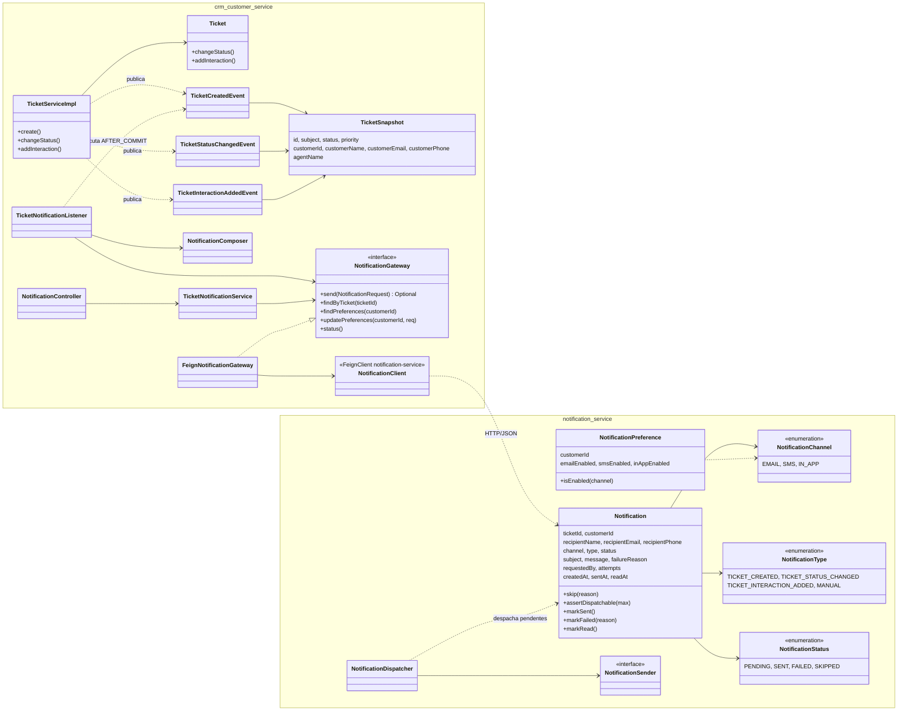
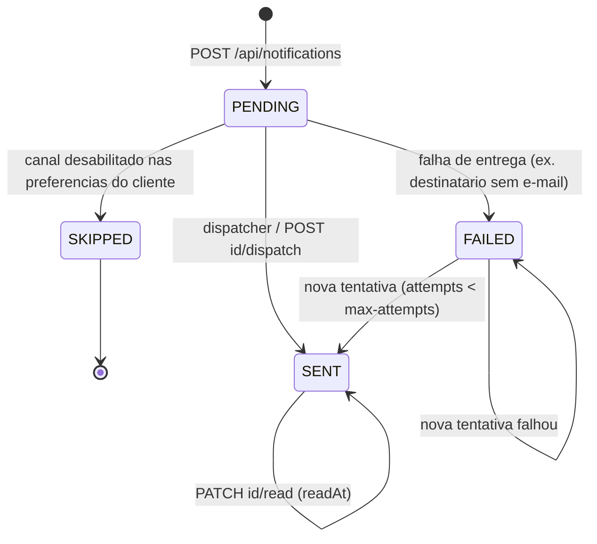
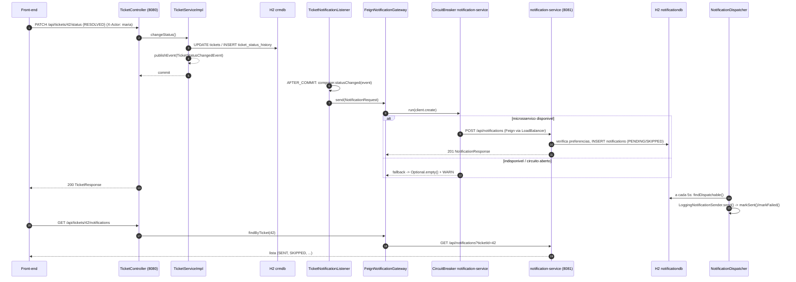
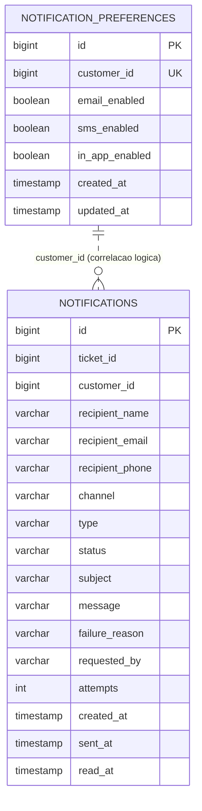

# CRM de Customer Service — Etapa 3 (TP3): Microsserviço de Notificações com Spring Boot + Spring Cloud

Este README descreve **somente o que mudou na Etapa 3**. A documentação do
monólito (bounded contexts, camada de persistência JPA/Spring Data, auditoria
Envers, endpoints de clientes/atendentes/tickets e testes das etapas
anteriores) está no README da tag **`tp2`** / branch **`TP2`**:
<https://github.com/MariiMariis/crm-customer-service/blob/TP2/README.md>.

## O que muda nesta versão

| Mudança | Onde |
|---|---|
| **Novo microsserviço `notification-service`** (porta 8081): registra, aplica preferências, despacha e consulta notificações ao cliente; banco H2 **próprio** | `notification-service/` |
| **Novo `config-server`** (porta 8888): Spring Cloud Config Server com as propriedades centralizadas dos dois serviços | `config-server/` |
| **Monólito integrado via Spring Cloud**: eventos de domínio do ticket, listener pós-commit, cliente OpenFeign resolvido por nome lógico (LoadBalancer + SimpleDiscoveryClient), circuit breaker Resilience4j, Config Client | `backend/src/main/java/com/pb/crm/notification/`, `backend/src/main/java/com/pb/crm/ticket/event/`, `TicketServiceImpl`, `GlobalExceptionHandler` (503) |
| **Novos endpoints REST no monólito** para acesso ao microsserviço | `NotificationController` (`/api/tickets/{id}/notifications`, `/api/customers/{id}/notification-preferences`, `/api/notifications/status`) |
| **Novos componentes de interface**: página Notificações, painel de notificações no ticket, preferências por cliente, indicador de saúde do microsserviço | `frontend/app/notifications/`, `frontend/components/{TicketNotifications,NotificationPreferences,ServiceStatus}.jsx`, `frontend/lib/notificationApi.js` |
| **Build multi-módulo** (`pom.xml` agregador na raiz, Maven Wrapper na raiz) e **run configurations do IntelliJ** (`.run/`) para subir os três serviços | raiz do repositório |
| **Novos testes**: 29 no microsserviço, 3 no config server, 17 no monólito (eventos, gateway, circuit breaker, API) | `*/src/test` |

Versões dos módulos passam a **0.3.0**. Spring Cloud **2023.0.3** (compatível
com Spring Boot 3.3.4).

## Estrutura adicionada

```
crm-customer-service/
├── pom.xml                  # NOVO: agregador Maven (config-server, notification-service, backend)
├── mvnw / mvnw.cmd          # NOVO: Maven Wrapper na raiz
├── .run/                    # NOVO: run configurations do IntelliJ (um clique por serviço + composta)
├── config-server/           # NOVO: Spring Cloud Config Server (8888)
│   └── src/main/resources/config/   # application / crm-customer-service / notification-service .properties
├── notification-service/    # NOVO: microsserviço de notificações (8081)
│   ├── data/                # notificationdb (H2 em arquivo, gerado em runtime, ignorado pelo Git)
│   └── src/main/java/com/pb/notification/
│       ├── config/          # NotificationProperties, PersistenceConfig (auditing + scheduling), CORS
│       ├── common/          # ApiError, exceções, handler global
│       ├── notification/    # agregado Notification, repositório, Specifications, serviço, dispatcher, sender, API
│       └── preference/      # NotificationPreference, repositório, serviço, API
├── backend/                 # monólito (8080) — alterações:
│   └── src/main/java/com/pb/crm/
│       ├── notification/    # NOVO: NotificationClient (Feign), FeignNotificationGateway, TicketNotificationListener,
│       │                    #       NotificationComposer, TicketNotificationService, NotificationController, DTOs
│       └── ticket/event/    # NOVO: TicketSnapshot, TicketCreatedEvent, TicketStatusChangedEvent, TicketInteractionAddedEvent
└── frontend/                # alterações: página Notificações, novos componentes, lib/notificationApi.js
```

## Pré-requisitos

- **Java 21** (JDK) — os três módulos compilam com `release 21`
- **IntelliJ IDEA** (Community ou Ultimate) — abrir a **pasta raiz** do
  repositório; o `pom.xml` agregador importa os módulos `config-server`,
  `notification-service` e `crm-customer-service` (backend)
- **Node.js 18+** e **npm** — para o front-end

Não é necessário instalar o Maven: use o Maven Wrapper (`mvnw` / `mvnw.cmd`)
ou o Maven embutido do IntelliJ.

## Como executar

Ordem recomendada: **Config Server → microsserviço → monólito → front-end**.
O Config Server é opcional: sem ele, cada serviço usa seu
`application.properties` local (import `optional:configserver:`).

### No IntelliJ (recomendado)

1. `File > Open` na pasta raiz `crm-customer-service/`; o IntelliJ importa os
   três módulos Maven.
2. Em `Project Structure > SDK`, selecione um **JDK 21**.
3. No seletor de run configurations aparecem as configurações compartilhadas
   da pasta `.run/`:
   - **Config Server (8888)**
   - **Notification Service (8081)**
   - **CRM Backend (8080)**
   - **Todos os servicos** — configuração composta que sobe os três de uma vez.
4. Rode **Todos os servicos** (▶) e, depois, o front-end.

Cada configuração define o *working directory* do módulo, para que os bancos
H2 fiquem em `backend/data/` e `notification-service/data/`.

### Via terminal

```bash
# na raiz do repositório (Linux/macOS: ./mvnw ; Windows: mvnw.cmd), um terminal por serviço
mvnw.cmd -q -f config-server/pom.xml spring-boot:run          # 1) 8888 (opcional)
mvnw.cmd -q -f notification-service/pom.xml spring-boot:run   # 2) 8081
mvnw.cmd -q -f backend/pom.xml spring-boot:run                # 3) 8080

cd frontend && npm install && npm run dev                     # 4) 3000
```

Compilar e testar tudo de uma vez: `mvnw.cmd verify` (raiz).

### Portas, bancos e observabilidade

| Serviço | Porta | Banco | Endpoints úteis |
|---|---|---|---|
| `config-server` | 8888 | — | `GET /notification-service/default`, `GET /crm-customer-service/default`, `/actuator/health` |
| `notification-service` | 8081 | `notification-service/data/notificationdb` (console `/h2-console`, JDBC `jdbc:h2:file:./data/notificationdb`, `sa`, sem senha) | `/api/notifications`, `/api/notification-preferences/{customerId}`, `/actuator/health`, `/actuator/info`, `/actuator/env/{prop}` |
| `backend` (monólito) | 8080 | `backend/data/crmdb` (inalterado) | novos: `/api/tickets/{id}/notifications`, `/api/customers/{id}/notification-preferences`, `/api/notifications/status`; `/actuator/health` (inclui `circuitBreakers` e `clientConfigServer`) |
| `frontend` | 3000 | — | `NEXT_PUBLIC_API_URL` (8080) e **novo** `NEXT_PUBLIC_NOTIFICATION_API_URL` (8081), ver `frontend/.env.local.example` |

O *dispatcher* do microsserviço (`app.notifications.dispatch.fixed-delay`,
padrão 5 s) processa as notificações pendentes e registra o envio simulado no
log:

```
[EMAIL] de PB CRM Customer Service <no-reply@pbcrm.com> para Ana Souza <ana.souza@empresa1.com> | ticket #1552 | Ticket #1552 aberto: ...
```

> Se o microsserviço estiver fora do ar, o monólito continua funcionando e a
> interface mostra "Microsservico de notificacoes offline".

### Testes

```bash
mvnw.cmd test                                      # raiz: config-server + notification-service + backend
mvnw.cmd -q -f notification-service/pom.xml test   # somente o microsserviço
mvnw.cmd -q -f backend/pom.xml test                # somente o monólito
```

Perfil `test`: H2 em memória, Config Client desabilitado, dispatcher
automático desligado. Detalhes em [Testes da Etapa 3](#testes-da-etapa-3).

---

## Microsserviço de notificações (Etapa 3)

Esta seção documenta a arquitetura do **microsserviço de notificações**
(`notification-service`), sua integração com o monólito via **Spring Cloud**,
os repositórios de dados dedicados, os novos endpoints REST, os componentes de
interface e a estratégia de testes.

### Motivação e responsabilidade

No CRM, toda movimentação relevante de um ticket (abertura, mudança de
status, nova interação) precisa ser comunicada ao cliente. Essa
responsabilidade é **ortogonal** ao domínio de atendimento: tem ciclo de vida,
volume, regras (preferências de canal, tentativas, falhas de entrega) e
requisitos de disponibilidade próprios. Por isso ela foi extraída para um
serviço independente, seguindo o princípio de **separação de
responsabilidades**:

| Responsabilidade | Onde fica |
|---|---|
| Regras de atendimento (tickets, clientes, atendentes, histórico, auditoria) | Monólito `crm-customer-service` (8080) |
| Decidir **quando** notificar e **o que** dizer (composição das mensagens) | Monólito — `notification/TicketNotificationListener` + `NotificationComposer` |
| Registrar, aplicar preferências, despachar, reprocessar e consultar notificações | Microsserviço `notification-service` (8081) |
| Preferências de canal por cliente (e-mail / SMS / in-app) | Microsserviço — bounded context `preference` |
| Configuração centralizada dos dois serviços | `config-server` (8888) |

O monólito **não conhece** o banco do microsserviço nem suas entidades: a
integração acontece exclusivamente por HTTP/REST, através de um contrato de
DTOs. O microsserviço, por sua vez, não conhece `Ticket`, `Customer` ou
`Agent`; ele recebe apenas identificadores e os dados do destinatário.

### Arquitetura

```mermaid
flowchart LR
    subgraph Browser["Front-end Next.js (3000)"]
        UI[Dashboard · Tickets · Clientes · Notificacoes]
    end

    subgraph Mono["Monolito crm-customer-service (8080)"]
        TC[TicketController]
        TS[TicketServiceImpl<br/>publica eventos de dominio]
        EV((TicketCreatedEvent<br/>TicketStatusChangedEvent<br/>TicketInteractionAddedEvent))
        LST[TicketNotificationListener<br/>@TransactionalEventListener AFTER_COMMIT]
        CMP[NotificationComposer]
        NC[NotificationController<br/>/api/tickets/id/notifications<br/>/api/customers/id/notification-preferences<br/>/api/notifications/status]
        TNS[TicketNotificationService]
        GW[FeignNotificationGateway<br/>Spring Cloud CircuitBreaker]
        FC[NotificationClient<br/>@FeignClient notification-service]
        LB[Spring Cloud LoadBalancer<br/>SimpleDiscoveryClient]
        DB1[(H2 crmdb)]
    end

    subgraph Micro["Microsservico notification-service (8081)"]
        API[NotificationController<br/>NotificationPreferenceController]
        SVC[NotificationServiceImpl]
        PREF[NotificationPreferenceService]
        DSP[NotificationDispatcher<br/>@Scheduled]
        SND[LoggingNotificationSender]
        REPO[NotificationRepository<br/>NotificationPreferenceRepository]
        DB2[(H2 notificationdb)]
    end

    CFG[[Spring Cloud Config Server 8888<br/>native: classpath:/config]]

    UI -->|REST| TC
    UI -->|REST| NC
    UI -->|REST direto| API
    TC --> TS --> EV --> LST --> CMP --> GW
    NC --> TNS --> GW
    GW --> FC --> LB -->|HTTP| API
    TS --> DB1
    API --> SVC --> REPO --> DB2
    SVC --> PREF --> REPO
    DSP --> SVC --> SND
    CFG -. optional:configserver .-> Mono
    CFG -. optional:configserver .-> Micro
```

Pontos centrais do desenho:

* **Eventos de domínio dentro do monólito.** `TicketServiceImpl` não chama
  o microsserviço diretamente; ele publica `TicketCreatedEvent`,
  `TicketStatusChangedEvent` e `TicketInteractionAddedEvent` (pacote
  `ticket/event`) com um `TicketSnapshot` imutável. O
  `TicketNotificationListener` reage **após o commit** da transação
  (`@TransactionalEventListener(AFTER_COMMIT)`), o que garante que só se
  notifica o que foi efetivamente persistido — uma transição de status
  inválida (rollback) não gera notificação.
* **Porta e adaptador.** O listener e o serviço de integração dependem da
  interface `NotificationGateway`; `FeignNotificationGateway` é o adaptador
  que combina o Feign client com o circuit breaker. Nos testes o gateway é
  substituído por um mock.
* **Degradação graciosa.** Envios disparados por eventos são
  *fire-and-forget*: se o microsserviço estiver fora, o ticket é criado
  normalmente e um `WARN` é registrado. Consultas explícitas (listar
  notificações, preferências, envio manual) retornam **HTTP 503** com
  mensagem clara.
* **Duas formas de acesso do front-end.** As telas ligadas ao ticket e ao
  cliente passam pelo monólito (que valida a existência do ticket/cliente e
  propaga o ator); a central de notificações consome o microsserviço
  diretamente, evidenciando que ele é um serviço autônomo.

### Modelo de domínio atualizado



Regras do agregado `Notification` (microsserviço):



* `EMAIL` exige `recipientEmail`; `SMS` exige `recipientPhone`; `IN_APP` não
  exige contato. A ausência gera `FAILED` com `failureReason`.
* `SENT` e `SKIPPED` são finais para envio (409 ao tentar reenviar);
  `FAILED` aceita reenvio até `app.notifications.max-attempts` (padrão 3).
* Só notificações `SENT` podem ser marcadas como lidas, uma única vez.
* `requestedBy` recebe o `X-Actor` propagado pelo monólito (padrão `system`).

### Fluxo de integração



### Spring Cloud: configuração e comunicação distribuídas

| Componente Spring Cloud | Onde | Para que serve neste projeto |
|---|---|---|
| **Spring Cloud Config Server** (`spring-cloud-config-server`, perfil `native`) | `config-server` | Centraliza propriedades dos dois serviços em `config/*.properties` (`application`, `crm-customer-service`, `notification-service`). Ex.: cadência do dispatcher, remetente das notificações, parâmetros do circuit breaker, URI da instância do microsserviço. |
| **Spring Cloud Config Client** (`spring-cloud-starter-config`) | `backend`, `notification-service` | `spring.config.import=optional:configserver:http://localhost:8888`. Com o servidor ativo, as propriedades remotas **sobrescrevem** as locais (visível em `/actuator/env` e no health `clientConfigServer`). Sem servidor, o serviço sobe com o arquivo local. |
| **Spring Cloud OpenFeign** (`spring-cloud-starter-openfeign`) | `backend` | `NotificationClient` é um cliente REST **declarativo**: interface Java anotada com `@FeignClient(name = "notification-service")` e mapeamentos Spring MVC; serialização JSON, encoding e tratamento de erro ficam por conta do Feign. Timeouts em `spring.cloud.openfeign.client.config.notification-service.*`. |
| **Spring Cloud LoadBalancer + SimpleDiscoveryClient** (`spring-cloud-starter-loadbalancer`, `spring-cloud-commons`) | `backend` | O Feign client referencia o **nome lógico** `notification-service`, não uma URL. A resolução passa pelo `LoadBalancerClient`, que consulta o `DiscoveryClient`; a instância é declarada em `spring.cloud.discovery.client.simple.instances.notification-service[0].uri`. Trocar por Eureka/Consul é uma mudança de dependência e propriedades, sem tocar no código. `GET /api/notifications/status` mostra as instâncias descobertas. |
| **Spring Cloud CircuitBreaker (Resilience4j)** (`spring-cloud-starter-circuitbreaker-resilience4j`) | `backend` | `FeignNotificationGateway` envolve cada chamada em `circuitBreakerFactory.create("notification-service").run(supplier, fallback)`. O `Customizer<Resilience4JCircuitBreakerFactory>` em `NotificationClientConfig` aplica janela deslizante, taxa de falha, tempo em aberto e *time limiter* lidos de `app.notifications.circuit-breaker.*` (também servidos pelo Config Server). Estado exposto em `/actuator/health` (`circuitBreakers`) e em `/api/notifications/status`. |
| **Actuator** (Boot) | todos | `health`, `info`, `env` e `circuitbreakers`; o monólito usa `GET /actuator/health` do microsserviço, via Feign, para o indicador de disponibilidade da interface. |

Propriedades relevantes do monólito (`backend/src/main/resources/application.properties`):

```properties
spring.config.import=optional:configserver:http://localhost:8888
spring.cloud.discovery.client.simple.instances.notification-service[0].uri=http://localhost:8081
spring.cloud.openfeign.client.config.notification-service.connect-timeout=1000
spring.cloud.openfeign.client.config.notification-service.read-timeout=3000
app.notifications.enabled=true
app.notifications.circuit-breaker.sliding-window-size=6
app.notifications.circuit-breaker.minimum-number-of-calls=3
app.notifications.circuit-breaker.failure-rate-threshold=50
app.notifications.circuit-breaker.wait-duration-in-open-state-seconds=15
app.notifications.circuit-breaker.timeout-seconds=3
```

Propriedades do microsserviço (`notification-service/src/main/resources/application.properties`,
sobrescritas pelo Config Server quando disponível):

```properties
spring.config.import=optional:configserver:http://localhost:8888
spring.datasource.url=jdbc:h2:file:./data/notificationdb;DB_CLOSE_DELAY=-1;AUTO_SERVER=TRUE
app.notifications.sender-name=PB CRM Customer Service
app.notifications.sender-email=no-reply@pbcrm.local
app.notifications.dispatch.auto=true
app.notifications.dispatch.fixed-delay=5000
app.notifications.dispatch.batch-size=20
app.notifications.max-attempts=3
app.cors.allowed-origins=http://localhost:3000
```

#### Resiliência: comportamento por operação

| Operação do monólito | Falha do microsserviço / circuito aberto | Resultado para o usuário |
|---|---|---|
| Criar ticket, mudar status, adicionar interação (eventos) | `send()` cai no fallback → `Optional.empty()` + `WARN` no log | Operação de atendimento **concluída normalmente**; notificação não registrada |
| `GET /api/tickets/{id}/notifications` | fallback lança `NotificationServiceUnavailableException` | **503 Service Unavailable** com mensagem |
| `POST /api/tickets/{id}/notifications` (envio manual) | idem | **503** |
| `GET/PUT /api/customers/{id}/notification-preferences` | idem | **503** |
| `GET /api/notifications/status` | health via Feign falha | **200** com `available=false`, `health=DOWN` e `circuitState` (`CLOSED`/`OPEN`/`HALF_OPEN`) |

Com `sliding-window-size=6`, `minimum-number-of-calls=3` e
`failure-rate-threshold=50`, três falhas consecutivas abrem o circuito; por 15 s
as chamadas são rejeitadas imediatamente (`CallNotPermittedException`), sem
esperar timeout de rede; depois o circuito passa a `HALF_OPEN` e permite duas
chamadas de teste. `app.notifications.enabled=false` desliga a integração por
completo (útil para rodar o monólito isolado).

### Repositórios de dados dedicados

O microsserviço possui **banco próprio** (`notification-service/data/notificationdb`,
H2 em arquivo, schema mantido por `ddl-auto=update`), sem chaves estrangeiras
para o banco do monólito — `ticket_id` e `customer_id` são apenas
identificadores de correlação (*database per service*).



Índices: `ticket_id`, `customer_id`, `status`, `created_at` em `notifications`;
`uk_notification_preferences_customer` garante uma preferência por cliente.

```java
public interface NotificationRepository extends JpaRepository<Notification, Long>,
        JpaSpecificationExecutor<Notification> {

    List<Notification> findByTicketIdOrderByCreatedAtDesc(Long ticketId);
    List<Notification> findByCustomerIdOrderByCreatedAtDesc(Long customerId);
    long countByStatus(NotificationStatus status);
    long countByTicketId(Long ticketId);
    long countByStatusAndReadAtIsNull(NotificationStatus status);

    @Query("""
            select n from Notification n
            where n.status = com.pb.notification.notification.NotificationStatus.PENDING
               or (n.status = com.pb.notification.notification.NotificationStatus.FAILED and n.attempts < :maxAttempts)
            order by n.createdAt asc, n.id asc
            """)
    List<Notification> findDispatchable(@Param("maxAttempts") int maxAttempts, Pageable pageable);

    @Query("select n.status as status, count(n) as total from Notification n group by n.status")
    List<NotificationStatusCount> countGroupedByStatus();

    @Query("select n.channel as channel, count(n) as total from Notification n group by n.channel")
    List<NotificationChannelCount> countGroupedByChannel();
}

public interface NotificationPreferenceRepository extends JpaRepository<NotificationPreference, Long> {
    Optional<NotificationPreference> findByCustomerId(Long customerId);
    boolean existsByCustomerId(Long customerId);
    long countByEmailEnabledFalse();
}
```

`NotificationSpecifications.withFilter(NotificationFilter)` compõe filtros
opcionais (`ticketId`, `customerId`, `status`, `channel`, `type`) para o
endpoint de listagem. `@EnableJpaAuditing` preenche `created_at`/`updated_at`.

### API REST do microsserviço (`http://localhost:8081`)

| Método e caminho | Descrição | Respostas |
|---|---|---|
| `POST /api/notifications` | Registra uma notificação. Aplica as preferências do cliente: canal desabilitado → `SKIPPED`. | `201` `NotificationResponse`; `400` validação |
| `GET /api/notifications?ticketId=&customerId=&status=&channel=&type=` | Lista (mais recentes primeiro) com filtros opcionais | `200` lista; `400` filtro inválido |
| `GET /api/notifications/{id}` | Detalhe | `200`; `404` |
| `GET /api/notifications/stats` | Totais por status e canal, total e não lidas | `200` `NotificationStatsResponse` |
| `POST /api/notifications/dispatch` | Processa imediatamente o lote de pendentes/retentáveis | `200` `{"processed": n}` |
| `POST /api/notifications/{id}/dispatch` | Envia (ou reenvia) uma notificação específica | `200`; `404`; `409` já enviada / ignorada / limite de tentativas |
| `PATCH /api/notifications/{id}/read` | Marca como lida (`readAt`) | `200`; `404`; `409` não enviada ou já lida |
| `DELETE /api/notifications/{id}` | Remove | `204`; `404` |
| `GET /api/notification-preferences/{customerId}` | Preferências do cliente (padrão: todos os canais habilitados, `persisted=false`) | `200` |
| `PUT /api/notification-preferences/{customerId}` | Cria/atualiza preferências (`emailEnabled`, `smsEnabled`, `inAppEnabled`) | `200`; `400` |
| `GET /actuator/health`, `/actuator/info`, `/actuator/env/{prop}` | Observabilidade | `200` |

`NotificationRequest` (corpo do `POST /api/notifications`):

```json
{
  "ticketId": 42, "customerId": 7,
  "recipientName": "Ana Souza", "recipientEmail": "ana.souza@empresa1.com", "recipientPhone": "11988887777",
  "channel": "EMAIL", "type": "TICKET_STATUS_CHANGED",
  "subject": "Ticket #42 atualizado para RESOLVED",
  "message": "Ola Ana Souza, o status do seu chamado ... mudou de IN_PROGRESS para RESOLVED.",
  "requestedBy": "maria"
}
```

Exemplo de `NotificationResponse`:

```json
{
  "id": 5, "ticketId": 42, "customerId": 7,
  "recipientName": "Ana Souza", "recipientEmail": "ana.souza@empresa1.com", "recipientPhone": "11988887777",
  "channel": "EMAIL", "type": "MANUAL", "status": "SENT",
  "subject": "Retorno sobre a cobranca", "message": "Estornaremos o valor em ate 5 dias.",
  "failureReason": null, "requestedBy": "maria", "attempts": 1,
  "createdAt": "2026-09-17T19:22:10.812Z", "sentAt": "2026-09-17T19:22:11.325Z", "readAt": null
}
```

Erros seguem o mesmo formato `ApiError` do monólito
(`timestamp`, `status`, `error`, `message`, `details`).

### Novos endpoints do monólito

Todos aceitam o cabeçalho `X-Actor`, que é propagado ao microsserviço como
`requestedBy`.

| Método e caminho | Descrição | Respostas |
|---|---|---|
| `GET /api/tickets/{id}/notifications` | Notificações do ticket (delegado ao microsserviço via Feign) | `200`; `404` ticket inexistente; `503` |
| `POST /api/tickets/{id}/notifications` | Envio **manual** ao cliente do ticket: `{"channel":"EMAIL|SMS|IN_APP","subject":"...","message":"..."}`. O monólito resolve nome/e-mail/telefone do cliente e monta o `NotificationRequest` (`type=MANUAL`). | `201`; `400`; `404`; `503` |
| `GET /api/customers/{id}/notification-preferences` | Preferências de notificação do cliente | `200`; `404`; `503` |
| `PUT /api/customers/{id}/notification-preferences` | Atualiza preferências | `200`; `400`; `404`; `503` |
| `GET /api/notifications/status` | Saúde da integração: `enabled`, `available`, `health`, `circuitState`, `instances` | `200` |

```bash
curl -X POST http://localhost:8080/api/tickets/1/notifications \
  -H "Content-Type: application/json" -H "X-Actor: maria" \
  -d '{"channel":"EMAIL","subject":"Retorno sobre a cobranca","message":"Estornaremos o valor em ate 5 dias."}'

curl http://localhost:8080/api/tickets/1/notifications
curl -X PUT http://localhost:8080/api/customers/1/notification-preferences \
  -H "Content-Type: application/json" -d '{"emailEnabled":true,"smsEnabled":false,"inAppEnabled":true}'
curl http://localhost:8080/api/notifications/status
```

Notificações **automáticas** geradas pelos eventos do ticket:

| Evento no monólito | Tipo | Canal | Conteúdo (composto por `NotificationComposer`) |
|---|---|---|---|
| `POST /api/tickets` | `TICKET_CREATED` | EMAIL | "Ticket #id aberto: assunto" — saudação, prioridade e número para acompanhamento |
| `PATCH /api/tickets/{id}/status` | `TICKET_STATUS_CHANGED` | EMAIL | "Ticket #id atualizado para STATUS" — transição `de → para` e motivo, se informado |
| `POST /api/tickets/{id}/interactions` | `TICKET_INTERACTION_ADDED` | IN_APP | "Nova interacao no ticket #id" — autor e mensagem |

### Componentes de front-end

| Componente / página | Fonte de dados | O que faz |
|---|---|---|
| `app/notifications/page.jsx` — página **Notificações** (novo item no `NavBar`) | Microsserviço (`lib/notificationApi.js`, `NEXT_PUBLIC_NOTIFICATION_API_URL`) | Cartões de estatísticas (total, pendentes, enviadas, falhas, ignoradas, não lidas); fila com filtros por status, canal, tipo e ticket; ações **enviar**, **marcar lida**, **excluir** e **Processar pendentes** |
| `components/TicketNotifications.jsx` (no detalhe do ticket) | Monólito (`getTicketNotifications`, `sendTicketNotification`) | Tabela de notificações do ticket (tipo, canal, status com motivo de falha, ator, datas) e formulário de **envio manual**; recarrega após mudança de status/interação; desabilitado em ticket `CLOSED` |
| `components/NotificationPreferences.jsx` (na página Clientes, botão **Notificacoes**) | Monólito (`getNotificationPreferences`, `updateNotificationPreferences`) | Painel com os três canais (checkbox) e persistência no microsserviço; indica se está usando o padrão ou preferências salvas |
| `components/ServiceStatus.jsx` (dashboard e página Notificações) | Monólito (`getNotificationServiceStatus`) | Indicador online/offline do microsserviço, health, estado do circuit breaker e instância descoberta; atualiza a cada 15 s |
| `app/page.jsx` (dashboard) | Microsserviço (`getNotificationStats`) | Cartões "Notificacoes pendentes" e "Notificacoes enviadas" |
| `components/Badge.jsx` + `globals.css` | — | Badges para `PENDING/SENT/FAILED/SKIPPED` e `EMAIL/SMS/IN_APP` |

### Configuração centralizada (`config-server`)

| Arquivo em `config-server/src/main/resources/config/` | Aplicado a | Conteúdo |
|---|---|---|
| `application.properties` | todos os clientes | `platform.name`, `platform.environment`, `platform.config-source=config-server` |
| `crm-customer-service.properties` | monólito | `app.notifications.enabled`, parâmetros do circuit breaker, `spring.cloud.discovery.client.simple.instances.notification-service[0].uri` |
| `notification-service.properties` | microsserviço | remetente (`sender-name`, `sender-email`), dispatcher (`auto`, `fixed-delay`, `batch-size`), `max-attempts` |

Para comprovar a sobrescrita, com o Config Server ativo:
`GET http://localhost:8081/actuator/env/app.notifications.sender-email` →
`"source": "configserver:classpath:/config/notification-service.properties"`,
e o log do dispatcher passa a exibir `no-reply@pbcrm.com` (valor remoto) em
vez de `no-reply@pbcrm.local` (valor local).

### Testes da Etapa 3

| Módulo | Classe | Tipo | O que demonstra |
|---|---|---|---|
| notification-service | `notification/NotificationTest` | Unitário | Máquina de estados da notificação: envio, falha, ignorada, limite de tentativas, leitura única, exigência de contato por canal |
| notification-service | `notification/NotificationRepositoryTest` | `@DataJpaTest` | Auditoria de `created_at`, consultas derivadas, `findDispatchable` (pendentes + falhas retentáveis), agregações por status/canal, Specifications |
| notification-service | `preference/NotificationPreferenceRepositoryTest` | `@DataJpaTest` | Persistência com datas de auditoria, unicidade por cliente, contagem |
| notification-service | `notification/NotificationServiceTest` | `@SpringBootTest` | Criação e despacho, `SKIPPED` por preferência, `FAILED` sem contato e limite de tentativas, lote do dispatcher, leitura e estatísticas, exclusão/404, filtros |
| notification-service | `notification/NotificationDispatcherTest` | Unitário (Mockito) | Respeita `app.notifications.dispatch.auto` |
| notification-service | `NotificationApiIntegrationTest` | `@SpringBootTest` + MockMvc | Fluxo completo da API: preferências, criação (PENDING/SKIPPED), filtros, dispatch, leitura, 409, stats, exclusão, validação 400, actuator |
| config-server | `ConfigServerApplicationTests` | `@SpringBootTest` + MockMvc | Serve as propriedades de `notification-service` e `crm-customer-service`; health |
| backend | `notification/NotificationComposerTest` | Unitário | Composição de assunto/mensagem/canal por tipo de evento; truncamento |
| backend | `notification/TicketNotificationListenerTest` | `@SpringBootTest` + `@MockBean NotificationGateway` | Eventos publicados **após commit** para criação, status e interação; nenhuma notificação quando a transação falha |
| backend | `notification/FeignNotificationGatewayTest` | `@SpringBootTest` + `@MockBean NotificationClient` | Repasse ao Feign, fallback silencioso no envio, 503 nas consultas, **abertura do circuit breaker** após 3 falhas e bloqueio das chamadas seguintes, `status()` com instância descoberta |
| backend | `notification/NotificationApiIntegrationTest` | `@SpringBootTest` + MockMvc + `@MockBean NotificationGateway` | Novos endpoints do monólito: listagem, envio manual com `X-Actor`, 404/400/503, preferências, status |
| backend | testes das etapas anteriores (`CrmApiIntegrationTest` etc.) | — | Continuam passando com a integração ativa: sem microsserviço, o gateway degrada para o fallback |

Os testes que usam `@MockBean` criam contextos Spring adicionais; cada um
recebe um banco H2 em memória próprio (`@TestPropertySource`) para não colidir
com o contexto principal. O perfil `test` desabilita o Config Client
(`spring.cloud.config.enabled=false`) e o dispatcher automático do
microsserviço.

Totais na última execução (`mvnw.cmd verify` na raiz): config-server 3,
notification-service 29, backend 58 testes — 0 falhas.

### Roteiro de demonstração

1. Subir **Config Server**, **Notification Service**, **CRM Backend** (run
   configuration *Todos os servicos*) e o front-end (`npm run dev`).
2. Abrir `http://localhost:3000`: o dashboard mostra
   "Microsservico de notificacoes online · circuit breaker: CLOSED · instancia http://localhost:8081".
3. Em **Tickets**, abrir um ticket para um cliente. Em **Notificações**, a
   fila exibe `TICKET_CREATED` (`PENDING` → `SENT` em até 5 s). O log do
   microsserviço registra `[EMAIL] de PB CRM ... para <cliente>`.
4. No detalhe do ticket, mudar o status e registrar uma interação: surgem
   `TICKET_STATUS_CHANGED` (EMAIL) e `TICKET_INTERACTION_ADDED` (IN_APP) no
   painel "Notificacoes ao cliente (microsservico)".
5. Em **Clientes**, clicar em **Notificacoes** no cliente e desmarcar **SMS**.
   Voltar ao ticket e enviar uma notificação manual por SMS: status
   `SKIPPED` com motivo "canal SMS desabilitado nas preferencias do cliente".
   Enviar por EMAIL: `SENT`.
6. Parar o **Notification Service**. O dashboard passa a
   "Microsservico de notificacoes offline"; mudar o status de um ticket
   continua funcionando (log do monólito: `Nao foi possivel enviar a
   notificacao ... Connection refused`); após três falhas o
   `circuitState` fica `OPEN` e as chamadas são rejeitadas sem timeout.
   Listar notificações retorna **503**.
7. Subir o microsserviço novamente: após o tempo em aberto (15 s) o circuito
   fecha e a integração volta sem reiniciar o monólito.
8. Mostrar `http://localhost:8888/notification-service/default` e
   `http://localhost:8081/actuator/env/app.notifications.dispatch.fixed-delay`
   para evidenciar a configuração centralizada.

### Decisões de projeto e evolução

* **Chamada síncrona após commit vs. mensageria.** Optou-se por HTTP síncrono
  (Feign) protegido por circuit breaker, o que mantém a solução executável
  apenas com o IntelliJ (sem broker). Os eventos de domínio já isolam o
  ponto de publicação: substituir o listener por um *publisher* Kafka/RabbitMQ
  (Spring Cloud Stream) não altera `TicketServiceImpl`.
* **Contrato duplicado por serviço.** Cada serviço tem seus próprios DTOs
  (`com.pb.crm.notification.dto` e `com.pb.notification...dto`), evitando
  acoplamento por biblioteca compartilhada; o contrato é o JSON.
* **Descoberta via `SimpleDiscoveryClient`.** Suficiente para o ambiente
  local e didático; a migração para Eureka exige apenas
  `spring-cloud-starter-netflix-eureka-client` e a remoção da instância
  estática das propriedades.
* **Envio simulado.** `NotificationSender` é uma interface; a implementação
  `LoggingNotificationSender` registra no log. Um provedor real (SMTP, SMS
  gateway, push) entra como nova implementação sem tocar no serviço.
