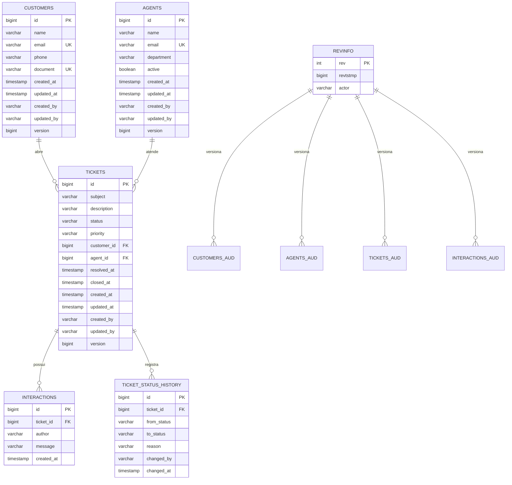
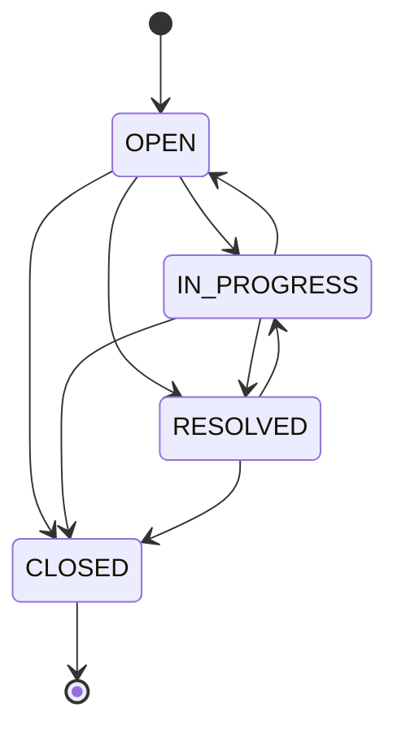
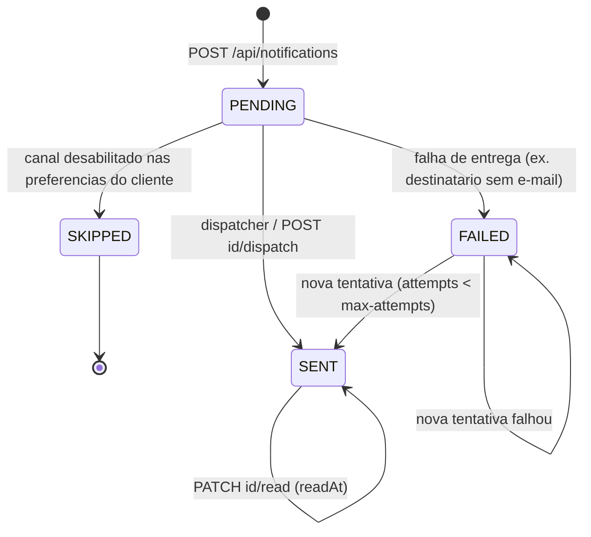
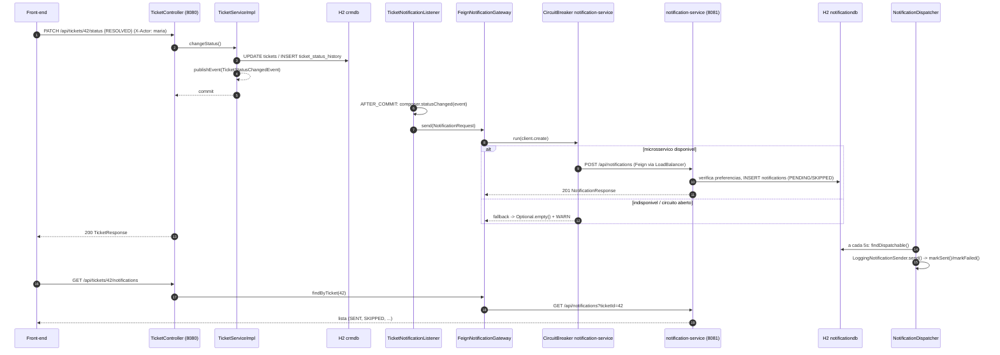
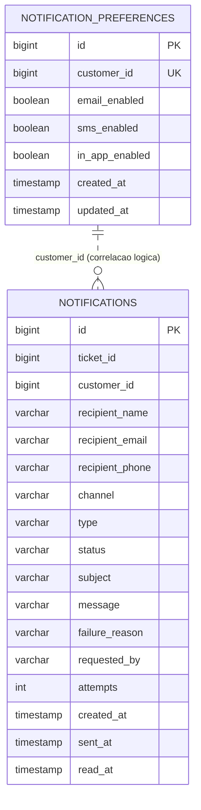

# CRM de Customer Service — Monólito Spring Boot + Microsserviço de Notificações (Spring Cloud) + React

Aplicação de atendimento ao cliente (CRM) desenvolvida como monólito
**Spring Boot** (back-end) com front-end **Next.js/React**, organizada em
camadas (controller/service/repository) e por bounded contexts de
Domain-Driven Design (Customer, Agent, Ticket). Na Etapa 3 o sistema passa a
ser **distribuído**: um novo **microsserviço de notificações** (Spring Boot +
Spring Cloud), com banco de dados próprio, é integrado ao monólito e à
interface.

| Etapa | Branch / tag | Documentação |
|---|---|---|
| Etapa 2 — camada de persistência (JPA, Spring Data, Envers) | `TP2` / `tp2` | [Camada de persistência (Etapa 2)](#camada-de-persistência-etapa-2) |
| Etapa 3 — microsserviço de notificações (Spring Boot + Spring Cloud) | `TP3` / `TP3` | [Microsserviço de notificações (Etapa 3)](#microsserviço-de-notificações-etapa-3) |

## Stack

| Camada | Tecnologia |
|---|---|
| Monólito (`backend`) | Java 21, Spring Boot 3.3 (Web, Data JPA, Validation, Actuator), Spring Data Envers, Hibernate Envers, H2 (arquivo), Maven |
| Microsserviço (`notification-service`) | Java 21, Spring Boot 3.3 (Web, Data JPA, Validation, Actuator, Scheduling), H2 dedicado (arquivo), Spring Cloud Config Client |
| Config Server (`config-server`) | Spring Cloud Config Server (perfil `native`) |
| Comunicação distribuída | Spring Cloud 2023.0.3: OpenFeign, LoadBalancer + SimpleDiscoveryClient, Circuit Breaker (Resilience4j), Config |
| Front-end | Next.js 16 (App Router), React 18, JavaScript |
| Testes | JUnit 5, Spring Boot Test (`@DataJpaTest`, `@SpringBootTest`, MockMvc, `@MockBean`), Mockito, AssertJ |
| Documentação | Markdown + diagramas Mermaid |

## Estrutura do repositório

```
crm-customer-service/
├── pom.xml                  # agregador Maven: abre os 3 módulos de uma vez no IntelliJ
├── .run/                    # run configurations compartilhadas do IntelliJ (um clique por serviço)
├── config-server/           # Spring Cloud Config Server (porta 8888) — configuração centralizada
│   └── src/main/resources/config/   # application / crm-customer-service / notification-service .properties
├── notification-service/    # MICROSSERVIÇO de notificações (porta 8081) — banco H2 próprio
│   ├── data/                # notificationdb (gerado em runtime, ignorado pelo Git)
│   └── src/main/java/com/pb/notification/
│       ├── config/          # NotificationProperties, PersistenceConfig (auditing + scheduling), CORS
│       ├── common/          # exceções e handler global
│       ├── notification/    # agregado Notification, repositório, serviço, dispatcher, API REST
│       └── preference/      # preferências de notificação por cliente (entidade, repositório, API)
├── backend/                 # MONÓLITO (porta 8080)
│   ├── data/                # crmdb (gerado em runtime, ignorado pelo Git)
│   └── src/main/java/com/pb/crm/
│       ├── audit/  config/  common/  customer/  agent/
│       ├── ticket/          # agregado Ticket + ticket/event (eventos de domínio publicados pelo serviço)
│       └── notification/    # NOVO: Feign client, gateway resiliente, listener de eventos, endpoints de integração
└── frontend/                # Next.js: consome o monólito (8080) e o microsserviço (8081)
```

## Pré-requisitos

- **Java 21** (JDK) — os três módulos Spring compilam com `release 21`
- **IntelliJ IDEA** (Community ou Ultimate) — abra a **pasta raiz** do
  repositório; o `pom.xml` agregador importa os módulos `config-server`,
  `notification-service` e `crm-customer-service` (backend)
- **Node.js 18+** e **npm** — para o front-end

Não é necessário instalar o Maven manualmente: o projeto inclui o **Maven
Wrapper** na raiz (`mvnw` / `mvnw.cmd`) e em `backend/`, e o IntelliJ também
traz um Maven embutido.

## Como executar

A ordem recomendada é **Config Server → microsserviço → monólito →
front-end**. O Config Server é opcional: se não estiver rodando, cada serviço
usa o seu `application.properties` local (import `optional:configserver:`).

### No IntelliJ (recomendado)

1. `File > Open` na pasta raiz `crm-customer-service/`. O IntelliJ detecta o
   `pom.xml` agregador e importa os três módulos Maven.
2. Em `Project Structure > SDK`, selecione um **JDK 21**.
3. No seletor de run configurations aparecem as configurações compartilhadas
   da pasta `.run/`:
   - **Config Server (8888)**
   - **Notification Service (8081)**
   - **CRM Backend (8080)**
   - **Todos os servicos** — configuração composta que sobe os três de uma vez.
4. Rode **Todos os servicos** (▶) e, depois, o front-end (abaixo).

Cada configuração define o *working directory* do módulo correspondente, para
que os bancos H2 sejam criados em `backend/data/` e
`notification-service/data/`.

### Via terminal

```bash
# na raiz do repositório (Linux/macOS: ./mvnw ; Windows: mvnw.cmd)
mvnw.cmd -q -f config-server/pom.xml spring-boot:run          # 1) porta 8888 (opcional)
mvnw.cmd -q -f notification-service/pom.xml spring-boot:run   # 2) porta 8081
mvnw.cmd -q -f backend/pom.xml spring-boot:run                # 3) porta 8080
```

Cada comando em um terminal próprio. Para compilar e testar tudo de uma vez:

```bash
mvnw.cmd verify
```

### 1. Back-end / monólito (porta 8080)

Classe principal: `com.pb.crm.CrmCustomerServiceApplication`
(run configuration **CRM Backend (8080)**).

A API sobe em `http://localhost:8080`. Health check com o estado da integração:
`http://localhost:8080/actuator/health` (inclui `circuitBreakers` e
`clientConfigServer`).

O banco H2 é criado em **`backend/data/crmdb.mv.db`** na primeira execução e
os dados **persistem entre reinícios**. Na primeira subida (banco vazio) o
`DataSeeder` carrega clientes, atendentes e tickets de exemplo, já com
histórico de status e revisões. Para começar do zero, pare a aplicação e apague
a pasta `backend/data/`. Para subir sem carga inicial, use
`app.seed.enabled=false`.

Console H2: `http://localhost:8080/h2-console` (JDBC URL
`jdbc:h2:file:./data/crmdb`, usuário `sa`, sem senha). Além das tabelas de
negócio, é possível inspecionar as tabelas de auditoria `*_AUD`, `REVINFO` e
`TICKET_STATUS_HISTORY`.

> **Windows:** a aplicação define `jdk.net.unixdomain.tmpdir` para
> `%SystemRoot%\Temp` ao iniciar, contornando uma falha do JDK ao abrir o
> loopback do NIO em alguns perfis de usuário ("Unable to establish loopback
> connection"). Se preferir, defina a propriedade nas opções de VM do IntelliJ.

#### Endpoints

Cabeçalho opcional em qualquer requisição: `X-Actor: <nome>` — identifica quem
está operando; é gravado em `created_by`/`updated_by`, no histórico de status e
nas revisões Envers (padrão: `system`).

| Recurso | Endpoints |
|---|---|
| Clientes | `GET/POST /api/customers`, `GET/PUT/DELETE /api/customers/{id}`, `GET /api/customers/search?q=&page=&size=&sort=`, `GET /api/customers/{id}/revisions` |
| Atendentes | `GET/POST /api/agents` (`?active=true`), `GET/PUT/DELETE /api/agents/{id}`, `GET /api/agents/{id}/revisions` |
| Tickets | `GET /api/tickets` (`?status=&customerId=`), `POST /api/tickets`, `GET/PUT/DELETE /api/tickets/{id}`, `PATCH /api/tickets/{id}/status` (`{"status","reason"}`), `POST /api/tickets/{id}/interactions` |
| Consultas de tickets | `GET /api/tickets/search?status=&priority=&customerId=&agentId=&subject=&createdFrom=&createdTo=&page=&size=&sort=`, `GET /api/tickets/stats` |
| Histórico | `GET /api/tickets/{id}/status-history`, `GET /api/tickets/{id}/revisions` |
| **Notificações (Etapa 3, via microsserviço)** | `GET/POST /api/tickets/{id}/notifications`, `GET/PUT /api/customers/{id}/notification-preferences`, `GET /api/notifications/status` — detalhes em [Novos endpoints do monólito](#novos-endpoints-do-monólito) |

Respostas de erro: `404` (não encontrado), `400` (validação/parâmetro
inválido), `409` (regra de negócio, duplicidade, vínculo de integridade ou
conflito de versão), `503` (microsserviço de notificações indisponível ou
circuit breaker aberto).

Exemplo com `curl`:

```bash
curl -X PATCH http://localhost:8080/api/tickets/1/status \
  -H "Content-Type: application/json" -H "X-Actor: maria" \
  -d '{"status":"RESOLVED","reason":"cliente confirmou a solucao"}'

curl http://localhost:8080/api/tickets/1/status-history
curl http://localhost:8080/api/tickets/1/revisions
```

### 2. Microsserviço de notificações (porta 8081)

Classe principal: `com.pb.notification.NotificationServiceApplication`
(run configuration **Notification Service (8081)**).

A API sobe em `http://localhost:8081/api/notifications`. O banco H2 dedicado
é criado em **`notification-service/data/notificationdb.mv.db`** (console:
`http://localhost:8081/h2-console`, JDBC URL `jdbc:h2:file:./data/notificationdb`,
usuário `sa`, sem senha). Health/info: `http://localhost:8081/actuator/health`
e `/actuator/info`; a origem de cada propriedade pode ser inspecionada em
`/actuator/env/<propriedade>` (ex.: `/actuator/env/app.notifications.dispatch.fixed-delay`
mostra `configserver:classpath:/config/notification-service.properties` quando
o Config Server está ativo).

Um *dispatcher* agendado (`app.notifications.dispatch.fixed-delay`, padrão 5 s)
processa as notificações pendentes e registra o envio simulado no log:

```
[EMAIL] de PB CRM Customer Service <no-reply@pbcrm.com> para Ana Souza <ana.souza@empresa1.com> | ticket #1552 | Ticket #1552 aberto: ...
```

### 3. Config Server (porta 8888, opcional)

Classe principal: `com.pb.configserver.ConfigServerApplication`
(run configuration **Config Server (8888)**). Serve as propriedades de
`config-server/src/main/resources/config/` para os dois serviços:

```bash
curl http://localhost:8888/notification-service/default
curl http://localhost:8888/crm-customer-service/default
```

Se o Config Server não estiver rodando, os serviços iniciam normalmente com
as propriedades locais (o import é `optional:`) — apenas registram um aviso.

### 4. Front-end (porta 3000)

```bash
cd frontend
npm install
npm run dev
```

Acesse `http://localhost:3000`. O front-end espera o monólito em
`http://localhost:8080/api` (`NEXT_PUBLIC_API_URL`) e o microsserviço em
`http://localhost:8081/api` (`NEXT_PUBLIC_NOTIFICATION_API_URL`); veja
`frontend/.env.local.example`. O nome enviado no cabeçalho `X-Actor` pode ser
alterado com `NEXT_PUBLIC_ACTOR`.

Além das telas da Etapa 2 (linha do tempo de status e revisões de auditoria
no ticket), a interface ganhou a página **Notificações**, o painel de
notificações no detalhe do ticket, as preferências de notificação por cliente
e o indicador de saúde do microsserviço no dashboard — ver
[Componentes de front-end](#componentes-de-front-end).

> Rode os serviços Spring **antes** do front-end para que o dashboard e as
> listagens carreguem os dados corretamente. Se o microsserviço estiver fora
> do ar, o monólito continua funcionando e a interface mostra o aviso
> "Microsservico de notificacoes offline".

### 5. Testes automatizados

```bash
mvnw.cmd test                                   # raiz: config-server + notification-service + backend
mvnw.cmd -q -f notification-service/pom.xml test   # somente o microsserviço
mvnw.cmd -q -f backend/pom.xml test                # somente o monólito
```

(Linux/macOS: `./mvnw`.) Os testes usam o perfil `test` (H2 em memória,
Config Client desabilitado) e cobrem, no monólito, repositórios, auditoria,
lock otimista, regras do agregado, a API REST e a integração com o
microsserviço (eventos, gateway resiliente, circuit breaker, endpoints); no
microsserviço, domínio, repositórios, serviço, dispatcher e API. Detalhes em
[Testes automatizados](#testes-automatizados) (Etapa 2) e
[Testes da Etapa 3](#testes-da-etapa-3).

---

## Camada de persistência (Etapa 2)

Esta seção descreve o design da camada de persistência do CRM, construída com
**JPA (Hibernate 6.5)**, **Spring Data JPA**, **Spring Data Envers** e
**Hibernate Envers** sobre **H2** em modo arquivo. Cobre: modelo de dados,
decisões de mapeamento, repositórios e exemplos de uso, gerenciamento de
transações/integridade/performance, histórico de mudanças (auditoria) e a
estratégia de testes.

### Visão geral

```
┌────────────────────────────────────────────────────────────────────────┐
│  Controllers (REST)  →  Services (@Transactional)  →  Repositories     │
│                                                          │             │
│                       Spring Data JPA + Envers ──────────┤             │
│                                                          ▼             │
│                       Hibernate ORM (JPA)  ──►  H2 (./data/crmdb)      │
│                          │                                             │
│                          ├─ AuditingEntityListener (created/updated)   │
│                          └─ Envers (tabelas *_aud + revinfo)           │
└────────────────────────────────────────────────────────────────────────┘
```

Princípios adotados:

| Princípio | Como foi aplicado |
|---|---|
| Isolamento de domínio | Um pacote por bounded context (`customer`, `agent`, `ticket`), cada um com entidade, repositório, serviço, controller e DTOs. Apenas o contexto de **Ticket** referencia os outros dois, e somente para leitura (associações `@ManyToOne`), nunca para alterá-los. |
| Modelagem orientada à consulta | Índices declarados para os filtros mais usados (`status`, `priority+status`, `customer_id`, `agent_id`, `created_at`), `@EntityGraph` e `join fetch` para evitar N+1, projeções para agregações. |
| Integridade | Chaves estrangeiras nomeadas, `unique constraints`, `@Version` (lock otimista), regras de transição de status no agregado `Ticket`, exceções traduzidas para HTTP 409. |
| Rastreabilidade | Dois níveis de histórico: **Envers** (foto de cada entidade a cada transação) e **`ticket_status_history`** (linha do tempo de status do ticket, legível para o negócio). |


### Modelo de dados

#### Diagrama entidade-relacionamento



#### Entidades e anotações JPA utilizadas

| Entidade | Tabela | Principais anotações |
|---|---|---|
| `AuditableEntity` (`@MappedSuperclass`) | — | `@CreatedDate`, `@LastModifiedDate`, `@CreatedBy`, `@LastModifiedBy`, `@Version`, `@EntityListeners(AuditingEntityListener)` |
| `Customer` | `customers` | `@Entity`, `@Table(uniqueConstraints, indexes)`, `@SequenceGenerator`, `@Audited`, `@AuditOverride` |
| `Agent` | `agents` | idem, índices em `department` e `active` |
| `Ticket` (raiz de agregado) | `tickets` | `@ManyToOne(LAZY)` para `Customer` e `Agent` com `@JoinColumn(foreignKey)`, `@OneToMany(mappedBy, cascade = ALL, orphanRemoval = true)` para interações e histórico, `@Enumerated(STRING)`, `@OrderBy`, `@NotAudited` na coleção de histórico |
| `Interaction` | `interactions` | `@ManyToOne(LAZY, optional = false)`, `@CreatedDate`, `@Audited` |
| `TicketStatusHistory` | `ticket_status_history` | `@ManyToOne(LAZY)`, `@CreatedBy`, `@CreatedDate`, índices por ticket e por status destino |
| `CrmRevisionEntity` | `revinfo` | `@RevisionEntity(CrmRevisionListener)`, `@RevisionNumber`, `@RevisionTimestamp`, coluna extra `actor` |

Decisões de mapeamento:

* **Geração de IDs por sequência** (`allocationSize = 50`): permite ao Hibernate
  reservar blocos de IDs e usar *batch inserts* (`hibernate.jdbc.batch_size=20`,
  `order_inserts/order_updates`), o que não é possível com `IDENTITY`.
* **Associações LAZY em todas as `@ManyToOne`**: o carregamento é decidido por
  consulta (`@EntityGraph`, `join fetch`, Specification com `fetch`), nunca
  implicitamente. `hibernate.default_batch_fetch_size=20` atua como rede de
  segurança contra N+1 em caminhos não otimizados.
* **`spring.jpa.open-in-view=false`**: sessões abertas apenas dentro das
  transações dos serviços; DTOs são montados dentro da transação.
* **Normalização no domínio**: e-mail em minúsculas e campos vazios convertidos
  para `null` dentro das entidades, garantindo que as *unique constraints*
  (`uk_customers_email`, `uk_customers_document`, `uk_agents_email`) tenham
  efeito e que vários clientes possam existir sem documento.
* **Agregado `Ticket`**: `Interaction` e `TicketStatusHistory` só existem por
  meio do ticket (`cascade = ALL`, `orphanRemoval = true`) e seus construtores
  são *package-private*; toda mudança de estado passa por métodos do agregado
  (`changeStatus`, `addInteraction`, `update`), que aplicam as regras de negócio.

#### Máquina de estados do ticket



* `TicketStatus.canTransitionTo` define as transições permitidas; transições
  inválidas ou repetidas lançam `BusinessRuleException` (HTTP 409).
* `RESOLVED` preenche `resolved_at`; `CLOSED` preenche `closed_at`; reabrir
  limpa ambos.
* Ticket `CLOSED` é terminal: não aceita edição nem novas interações.
* Cada transição gera uma linha em `ticket_status_history` (com `from`, `to`,
  `reason`, `changed_by`, `changed_at`), inclusive a abertura (`null → OPEN`).


### Repositórios Spring Data

Todos os repositórios estendem `JpaRepository`; os das entidades auditadas
também estendem `RevisionRepository<T, Long, Integer>` (Spring Data Envers),
habilitado por `EnversRevisionRepositoryFactoryBean` em `PersistenceConfig`.

#### `CustomerRepository`

```java
public interface CustomerRepository extends JpaRepository<Customer, Long>,
        RevisionRepository<Customer, Long, Integer> {

    Optional<Customer> findByEmailIgnoreCase(String email);
    boolean existsByEmailIgnoreCase(String email);
    boolean existsByEmailIgnoreCaseAndIdNot(String email, Long id);
    boolean existsByDocument(String document);
    boolean existsByDocumentAndIdNot(String document, Long id);
    List<Customer> findAllByOrderByNameAsc();
    Page<Customer> findByNameContainingIgnoreCase(String name, Pageable pageable);

    @Query("""
            select c from Customer c
            where lower(c.name) like lower(concat('%', :term, '%'))
               or lower(c.email) like lower(concat('%', :term, '%'))
               or c.document = :term
            """)
    Page<Customer> search(@Param("term") String term, Pageable pageable);
}
```

#### `AgentRepository`

```java
public interface AgentRepository extends JpaRepository<Agent, Long>,
        RevisionRepository<Agent, Long, Integer> {

    boolean existsByEmailIgnoreCase(String email);
    boolean existsByEmailIgnoreCaseAndIdNot(String email, Long id);
    List<Agent> findAllByOrderByNameAsc();
    List<Agent> findByActiveTrueOrderByNameAsc();
    List<Agent> findByDepartmentIgnoreCaseOrderByNameAsc(String department);
    long countByActiveTrue();
}
```

#### `TicketRepository`

```java
public interface TicketRepository extends JpaRepository<Ticket, Long>,
        JpaSpecificationExecutor<Ticket>,
        RevisionRepository<Ticket, Long, Integer> {

    @EntityGraph(attributePaths = {"customer", "agent"})
    List<Ticket> findAllByOrderByCreatedAtDesc();

    @EntityGraph(attributePaths = {"customer", "agent"})
    List<Ticket> findByStatusOrderByCreatedAtDesc(TicketStatus status);

    @EntityGraph(attributePaths = {"customer", "agent", "interactions"})
    Optional<Ticket> findWithDetailsById(Long id);

    boolean existsByCustomer_Id(Long customerId);
    long countByStatus(TicketStatus status);
    long countByAgent_IdAndStatusIn(Long agentId, List<TicketStatus> statuses);

    @Query("select t.status as status, count(t) as total from Ticket t group by t.status")
    List<TicketStatusCount> countGroupedByStatus();

    @Query("""
            select t from Ticket t
            join fetch t.customer c
            left join fetch t.agent
            where c.id = :customerId
            order by t.createdAt desc
            """)
    List<Ticket> findByCustomerWithRelations(@Param("customerId") Long customerId);
}
```

> Observação: `Ticket` expõe os *getters* de conveniência `getCustomerId()` e
> `getAgentId()`. Para que o Spring Data percorra a associação (`customer.id`)
> em vez de procurar uma propriedade `customerId`, os métodos derivados usam o
> separador explícito `_` (`existsByCustomer_Id`).

#### `TicketStatusHistoryRepository`

```java
public interface TicketStatusHistoryRepository extends JpaRepository<TicketStatusHistory, Long> {
    List<TicketStatusHistory> findByTicket_IdOrderByChangedAtAscIdAsc(Long ticketId);
    List<TicketStatusHistory> findByToStatusAndChangedAtBetween(TicketStatus toStatus, Instant from, Instant to);
    long countByTicket_Id(Long ticketId);

    @Query("select h from TicketStatusHistory h join fetch h.ticket t where h.changedBy = :actor order by h.changedAt desc")
    List<TicketStatusHistory> findByActor(@Param("actor") String actor);
}
```

#### Specifications (filtros dinâmicos)

`TicketSpecifications` compõe predicados opcionais a partir de `TicketFilter`;
critérios nulos são ignorados. `fetchRelations()` faz `fetch` de `customer` e
`agent` apenas na consulta de dados (não na de contagem), evitando N+1 na
listagem paginada.

```java
Specification<Ticket> spec = TicketSpecifications.withFilter(
        new TicketFilter(TicketStatus.OPEN, TicketPriority.HIGH, customerId, null, "login", null, null));

Page<Ticket> page = ticketRepository.findAll(spec,
        PageRequest.of(0, 10, Sort.by("createdAt").descending()));
```

#### Exemplos de uso nos serviços

```java
// CustomerServiceImpl.update — unicidade excluindo o próprio registro + lock otimista
if (customerRepository.existsByEmailIgnoreCaseAndIdNot(request.email(), id)) {
    throw new BusinessRuleException("ja existe outro cliente cadastrado com este email");
}
customer.update(request.name(), request.email(), request.phone(), request.document());
return CustomerResponse.fromEntity(customerRepository.saveAndFlush(customer));

// TicketServiceImpl.findById — carrega cliente, atendente e interações em uma consulta
return ticketRepository.findWithDetailsById(id)
        .map(TicketResponse::fromEntity)
        .orElseThrow(() -> ResourceNotFoundException.forId("Ticket", id));

// TicketServiceImpl.stats — projeção de interface para agregação
for (TicketStatusCount count : ticketRepository.countGroupedByStatus()) {
    byStatus.put(count.getStatus(), count.getTotal());
}

// Histórico de revisões (Envers) de qualquer entidade auditada
List<RevisionResponse<TicketResponse>> revisions = ticketRepository.findRevisions(ticketId).stream()
        .map(revision -> RevisionResponse.from(revision, TicketResponse::summaryFromEntity))
        .toList();
```


### Gerenciamento de dados: transações, integridade e performance

#### Transações

* Todos os métodos de serviço são `@Transactional`; consultas usam
  `readOnly = true` (Hibernate desliga *dirty checking* e o driver pode otimizar).
* Alterações são feitas em entidades gerenciadas dentro da transação; o
  `flush` explícito (`saveAndFlush`, `repository.flush()`) é usado quando o
  serviço precisa que violações de integridade ou de versão apareçam antes do
  retorno, para serem traduzidas em respostas HTTP adequadas.
* O `DataSeeder` executa a carga inicial em **várias transações pequenas**
  (`TransactionTemplate`), o que também produz um histórico Envers realista
  (uma revisão por transação).

#### Integridade

| Mecanismo | Onde | Efeito |
|---|---|---|
| Unique constraints | `customers.email`, `customers.document`, `agents.email` | Duplicidade → `DataIntegrityViolationException` → HTTP 409 |
| Verificações prévias no serviço | `existsByEmailIgnoreCase[AndIdNot]`, `existsByDocument[AndIdNot]` | Mensagem de negócio clara (HTTP 409) antes de chegar ao banco |
| Chaves estrangeiras | `fk_tickets_customer`, `fk_tickets_agent`, `fk_interactions_ticket`, `fk_status_history_ticket` | Excluir cliente/atendente com tickets → HTTP 409 |
| Lock otimista | `@Version` em `AuditableEntity` + campo `version` opcional nos `PUT` | Escrita concorrente com versão defasada → `OptimisticLockingFailureException` → HTTP 409 |
| Regras do agregado | `Ticket.changeStatus`, `Ticket.update`, `Ticket.addInteraction` | Transições inválidas / ticket fechado / atendente inativo → HTTP 409 |
| Cascata e órfãos | `cascade = ALL`, `orphanRemoval = true` | Interações e histórico removidos junto com o ticket |

`GlobalExceptionHandler` centraliza a tradução: `ResourceNotFoundException`
→ 404, validação → 400, `BusinessRuleException` / `DataIntegrityViolationException`
/ `OptimisticLockingFailureException` → 409.

#### Performance

* Índices em todas as colunas usadas em filtros e ordenações frequentes.
* `@EntityGraph` nas listagens e `join fetch` nas consultas por cliente.
* Specification com `fetch` condicional (somente na consulta de resultados).
* Paginação (`Pageable`) nos endpoints `/search`.
* Projeção `TicketStatusCount` para estatísticas (sem hidratar entidades).
* Sequências com `allocationSize = 50` + *batching* de inserts/updates.
* `default_batch_fetch_size = 20` para carregamento em lote de proxies LAZY.
* `open-in-view = false` evita conexões presas durante a serialização JSON.


### Histórico de mudanças (auditoria)

#### Auditoria de metadados (Spring Data JPA Auditing)

`@EnableJpaAuditing(auditorAwareRef = "auditorProvider")` preenche
`created_at`, `updated_at`, `created_by` e `updated_by` automaticamente. O
"ator" vem do cabeçalho HTTP **`X-Actor`** (via `RequestActor`); na ausência
dele (jobs, seeder, testes) é usado `system`.

#### Histórico completo de entidades (Hibernate Envers)

* Entidades anotadas com `@Audited`: `Customer`, `Agent`, `Ticket`, `Interaction`.
  `@AuditOverride(forClass = AuditableEntity.class)` inclui os campos herdados.
* Para cada entidade auditada existe uma tabela `<tabela>_aud` com as colunas
  da entidade mais `rev` (número da revisão) e `revtype` (`0` INSERT,
  `1` UPDATE, `2` DELETE).
* `revinfo` é a entidade de revisão customizada (`CrmRevisionEntity`) com o
  campo adicional `actor`, preenchido por `CrmRevisionListener`.
* `org.hibernate.envers.store_data_at_delete=true` guarda a última foto do
  registro na revisão de exclusão.
* Uma transação = uma revisão; todas as entidades alteradas na mesma transação
  compartilham o mesmo `rev`.

Consulta via Spring Data Envers:

```java
Revisions<Integer, Customer> revisions = customerRepository.findRevisions(id);
Optional<Revision<Integer, Customer>> last = customerRepository.findLastChangeRevision(id);
Optional<Revision<Integer, Customer>> specific = customerRepository.findRevision(id, 42);
```

Endpoints expostos:

| Endpoint | Retorno |
|---|---|
| `GET /api/customers/{id}/revisions` | Lista de revisões do cliente (número, timestamp, tipo, ator, dados) |
| `GET /api/agents/{id}/revisions` | Idem para atendente |
| `GET /api/tickets/{id}/revisions` | Idem para ticket (status, prioridade, atendente, datas em cada revisão) |
| `GET /api/tickets/{id}/status-history` | Linha do tempo de status (`fromStatus`, `toStatus`, `reason`, `changedBy`, `changedAt`) |

Exemplo de resposta de `GET /api/tickets/1/revisions`:

```json
[
  { "revision": 3, "timestamp": "2026-09-17T18:10:02.115Z", "type": "INSERT", "actor": "system",
    "data": { "id": 1, "status": "OPEN", "priority": "HIGH", "agentId": 1, "version": null } },
  { "revision": 4, "timestamp": "2026-09-17T18:10:02.310Z", "type": "UPDATE", "actor": "system",
    "data": { "id": 1, "status": "IN_PROGRESS", "priority": "HIGH", "agentId": 1, "version": null } }
]
```

> O campo `version` não é auditado pelo Envers (comportamento padrão para o
> campo de lock otimista), por isso aparece `null` nas revisões.

#### Quando usar cada histórico

| Necessidade | Fonte |
|---|---|
| "Quem mudou o quê e quando" em qualquer entidade, incluindo exclusões | Envers (`*_aud` + `revinfo`) |
| Linha do tempo de atendimento de um ticket, com motivo da mudança, para telas e relatórios | `ticket_status_history` |
| Métricas de SLA (tempo até `RESOLVED`/`CLOSED`) | `tickets.resolved_at` / `closed_at` + `ticket_status_history` |


### Configuração

`backend/src/main/resources/application.properties`:

| Propriedade | Valor | Motivo |
|---|---|---|
| `spring.datasource.url` | `jdbc:h2:file:./data/crmdb;AUTO_SERVER=TRUE` | Dados sobrevivem a reinícios; `AUTO_SERVER` permite abrir o console H2 em paralelo |
| `spring.jpa.hibernate.ddl-auto` | `update` | Mantém o schema (inclusive tabelas `_aud`) sem apagar dados |
| `spring.sql.init.mode` | `never` | Carga inicial passou a ser feita pelo `DataSeeder` (idempotente) |
| `app.seed.enabled` | `true` | Desative para subir com o banco vazio |
| `spring.jpa.open-in-view` | `false` | Ver [Performance](#performance) |
| `org.hibernate.envers.*` | sufixo `_aud`, colunas `rev`/`revtype`, `store_data_at_delete` | Convenções de auditoria |

Perfil `test` (`src/test/resources/application-test.properties`): H2 em
memória com `create-drop`, para isolamento total dos testes.

Console H2: `http://localhost:8080/h2-console` com JDBC URL
`jdbc:h2:file:./data/crmdb`, usuário `sa`, sem senha. Tabelas úteis para
inspeção: `TICKETS_AUD`, `CUSTOMERS_AUD`, `REVINFO`, `TICKET_STATUS_HISTORY`.


### Testes automatizados

| Classe | Tipo | O que demonstra |
|---|---|---|
| `persistence/CustomerRepositoryTest` | `@DataJpaTest` | Auditoria automática, incremento de `@Version`, unique constraints (e-mail/documento), múltiplos `null` em documento, consultas derivadas, `@Query` com paginação |
| `persistence/AgentRepositoryTest` | `@DataJpaTest` | Filtros derivados (`ActiveTrue`, `IgnoreCase`), contagem, unicidade, auditoria |
| `persistence/TicketRepositoryTest` | `@DataJpaTest` | Cascata de interações/histórico, `orphanRemoval`, `@EntityGraph`, `join fetch`, projeção de agregação, Specifications + paginação, FK impedindo exclusão de cliente |
| `persistence/OptimisticLockingIntegrationTest` | `@SpringBootTest` | Duas "sessões" atualizando o mesmo registro: a segunda falha com `OptimisticLockingFailureException` |
| `history/EnversAuditIntegrationTest` | `@SpringBootTest` | Revisões INSERT/UPDATE/DELETE de cliente e atendente; revisões e linha do tempo de status do ticket |
| `ticket/TicketStatusTransitionTest` | Unitário | Máquina de estados, datas de resolução/fechamento, bloqueios em ticket fechado |
| `CrmApiIntegrationTest` | `@SpringBootTest` + MockMvc | Fluxo ponta a ponta pela API, incluindo `X-Actor`, `/status-history`, `/revisions`, `/search`, `/stats` e respostas 404/400/409 |

Execução:

```bash
cd backend
./mvnw test          # Linux/macOS
mvnw.cmd test        # Windows
```

Os testes `@DataJpaTest` importam `PersistenceConfig` para ativar auditoria e a
fábrica de repositórios do Envers; os `@SpringBootTest` usam o perfil `test`
(H2 em memória), compartilham um único contexto e usam e-mails únicos para não
interferirem entre si.

---

## Microsserviço de notificações (Etapa 3)

Esta seção documenta a arquitetura do **microsserviço de notificações**
(`notification-service`), sua integração com o monólito via **Spring Cloud**,
os repositórios de dados dedicados, os novos endpoints REST, os componentes de
interface e a estratégia de testes.

### Motivação e responsabilidade

No CRM, toda movimentação relevante de um ticket (abertura, mudança de
status, nova interação) precisa ser comunicada ao cliente. Essa
responsabilidade é **ortogonal** ao domínio de atendimento: tem ciclo de vida,
volume, regras (preferências de canal, tentativas, falhas de entrega) e
requisitos de disponibilidade próprios. Por isso ela foi extraída para um
serviço independente, seguindo o princípio de **separação de
responsabilidades**:

| Responsabilidade | Onde fica |
|---|---|
| Regras de atendimento (tickets, clientes, atendentes, histórico, auditoria) | Monólito `crm-customer-service` (8080) |
| Decidir **quando** notificar e **o que** dizer (composição das mensagens) | Monólito — `notification/TicketNotificationListener` + `NotificationComposer` |
| Registrar, aplicar preferências, despachar, reprocessar e consultar notificações | Microsserviço `notification-service` (8081) |
| Preferências de canal por cliente (e-mail / SMS / in-app) | Microsserviço — bounded context `preference` |
| Configuração centralizada dos dois serviços | `config-server` (8888) |

O monólito **não conhece** o banco do microsserviço nem suas entidades: a
integração acontece exclusivamente por HTTP/REST, através de um contrato de
DTOs. O microsserviço, por sua vez, não conhece `Ticket`, `Customer` ou
`Agent`; ele recebe apenas identificadores e os dados do destinatário.

### Arquitetura

```mermaid
flowchart LR
    subgraph Browser["Front-end Next.js (3000)"]
        UI[Dashboard · Tickets · Clientes · Notificacoes]
    end

    subgraph Mono["Monolito crm-customer-service (8080)"]
        TC[TicketController]
        TS[TicketServiceImpl<br/>publica eventos de dominio]
        EV((TicketCreatedEvent<br/>TicketStatusChangedEvent<br/>TicketInteractionAddedEvent))
        LST[TicketNotificationListener<br/>@TransactionalEventListener AFTER_COMMIT]
        CMP[NotificationComposer]
        NC[NotificationController<br/>/api/tickets/id/notifications<br/>/api/customers/id/notification-preferences<br/>/api/notifications/status]
        TNS[TicketNotificationService]
        GW[FeignNotificationGateway<br/>Spring Cloud CircuitBreaker]
        FC[NotificationClient<br/>@FeignClient notification-service]
        LB[Spring Cloud LoadBalancer<br/>SimpleDiscoveryClient]
        DB1[(H2 crmdb)]
    end

    subgraph Micro["Microsservico notification-service (8081)"]
        API[NotificationController<br/>NotificationPreferenceController]
        SVC[NotificationServiceImpl]
        PREF[NotificationPreferenceService]
        DSP[NotificationDispatcher<br/>@Scheduled]
        SND[LoggingNotificationSender]
        REPO[NotificationRepository<br/>NotificationPreferenceRepository]
        DB2[(H2 notificationdb)]
    end

    CFG[[Spring Cloud Config Server 8888<br/>native: classpath:/config]]

    UI -->|REST| TC
    UI -->|REST| NC
    UI -->|REST direto| API
    TC --> TS --> EV --> LST --> CMP --> GW
    NC --> TNS --> GW
    GW --> FC --> LB -->|HTTP| API
    TS --> DB1
    API --> SVC --> REPO --> DB2
    SVC --> PREF --> REPO
    DSP --> SVC --> SND
    CFG -. optional:configserver .-> Mono
    CFG -. optional:configserver .-> Micro
```

Pontos centrais do desenho:

* **Eventos de domínio dentro do monólito.** `TicketServiceImpl` não chama
  o microsserviço diretamente; ele publica `TicketCreatedEvent`,
  `TicketStatusChangedEvent` e `TicketInteractionAddedEvent` (pacote
  `ticket/event`) com um `TicketSnapshot` imutável. O
  `TicketNotificationListener` reage **após o commit** da transação
  (`@TransactionalEventListener(AFTER_COMMIT)`), o que garante que só se
  notifica o que foi efetivamente persistido — uma transição de status
  inválida (rollback) não gera notificação.
* **Porta e adaptador.** O listener e o serviço de integração dependem da
  interface `NotificationGateway`; `FeignNotificationGateway` é o adaptador
  que combina o Feign client com o circuit breaker. Nos testes o gateway é
  substituído por um mock.
* **Degradação graciosa.** Envios disparados por eventos são
  *fire-and-forget*: se o microsserviço estiver fora, o ticket é criado
  normalmente e um `WARN` é registrado. Consultas explícitas (listar
  notificações, preferências, envio manual) retornam **HTTP 503** com
  mensagem clara.
* **Duas formas de acesso do front-end.** As telas ligadas ao ticket e ao
  cliente passam pelo monólito (que valida a existência do ticket/cliente e
  propaga o ator); a central de notificações consome o microsserviço
  diretamente, evidenciando que ele é um serviço autônomo.

### Modelo de domínio atualizado


Regras do agregado `Notification` (microsserviço):



* `EMAIL` exige `recipientEmail`; `SMS` exige `recipientPhone`; `IN_APP` não
  exige contato. A ausência gera `FAILED` com `failureReason`.
* `SENT` e `SKIPPED` são finais para envio (409 ao tentar reenviar);
  `FAILED` aceita reenvio até `app.notifications.max-attempts` (padrão 3).
* Só notificações `SENT` podem ser marcadas como lidas, uma única vez.
* `requestedBy` recebe o `X-Actor` propagado pelo monólito (padrão `system`).

### Fluxo de integração



### Spring Cloud: configuração e comunicação distribuídas

| Componente Spring Cloud | Onde | Para que serve neste projeto |
|---|---|---|
| **Spring Cloud Config Server** (`spring-cloud-config-server`, perfil `native`) | `config-server` | Centraliza propriedades dos dois serviços em `config/*.properties` (`application`, `crm-customer-service`, `notification-service`). Ex.: cadência do dispatcher, remetente das notificações, parâmetros do circuit breaker, URI da instância do microsserviço. |
| **Spring Cloud Config Client** (`spring-cloud-starter-config`) | `backend`, `notification-service` | `spring.config.import=optional:configserver:http://localhost:8888`. Com o servidor ativo, as propriedades remotas **sobrescrevem** as locais (visível em `/actuator/env` e no health `clientConfigServer`). Sem servidor, o serviço sobe com o arquivo local. |
| **Spring Cloud OpenFeign** (`spring-cloud-starter-openfeign`) | `backend` | `NotificationClient` é um cliente REST **declarativo**: interface Java anotada com `@FeignClient(name = "notification-service")` e mapeamentos Spring MVC; serialização JSON, encoding e tratamento de erro ficam por conta do Feign. Timeouts em `spring.cloud.openfeign.client.config.notification-service.*`. |
| **Spring Cloud LoadBalancer + SimpleDiscoveryClient** (`spring-cloud-starter-loadbalancer`, `spring-cloud-commons`) | `backend` | O Feign client referencia o **nome lógico** `notification-service`, não uma URL. A resolução passa pelo `LoadBalancerClient`, que consulta o `DiscoveryClient`; a instância é declarada em `spring.cloud.discovery.client.simple.instances.notification-service[0].uri`. Trocar por Eureka/Consul é uma mudança de dependência e propriedades, sem tocar no código. `GET /api/notifications/status` mostra as instâncias descobertas. |
| **Spring Cloud CircuitBreaker (Resilience4j)** (`spring-cloud-starter-circuitbreaker-resilience4j`) | `backend` | `FeignNotificationGateway` envolve cada chamada em `circuitBreakerFactory.create("notification-service").run(supplier, fallback)`. O `Customizer<Resilience4JCircuitBreakerFactory>` em `NotificationClientConfig` aplica janela deslizante, taxa de falha, tempo em aberto e *time limiter* lidos de `app.notifications.circuit-breaker.*` (também servidos pelo Config Server). Estado exposto em `/actuator/health` (`circuitBreakers`) e em `/api/notifications/status`. |
| **Actuator** (Boot) | todos | `health`, `info`, `env` e `circuitbreakers`; o monólito usa `GET /actuator/health` do microsserviço, via Feign, para o indicador de disponibilidade da interface. |

Propriedades relevantes do monólito (`backend/src/main/resources/application.properties`):

```properties
spring.config.import=optional:configserver:http://localhost:8888
spring.cloud.discovery.client.simple.instances.notification-service[0].uri=http://localhost:8081
spring.cloud.openfeign.client.config.notification-service.connect-timeout=1000
spring.cloud.openfeign.client.config.notification-service.read-timeout=3000
app.notifications.enabled=true
app.notifications.circuit-breaker.sliding-window-size=6
app.notifications.circuit-breaker.minimum-number-of-calls=3
app.notifications.circuit-breaker.failure-rate-threshold=50
app.notifications.circuit-breaker.wait-duration-in-open-state-seconds=15
app.notifications.circuit-breaker.timeout-seconds=3
```

Propriedades do microsserviço (`notification-service/src/main/resources/application.properties`,
sobrescritas pelo Config Server quando disponível):

```properties
spring.config.import=optional:configserver:http://localhost:8888
spring.datasource.url=jdbc:h2:file:./data/notificationdb;DB_CLOSE_DELAY=-1;AUTO_SERVER=TRUE
app.notifications.sender-name=PB CRM Customer Service
app.notifications.sender-email=no-reply@pbcrm.local
app.notifications.dispatch.auto=true
app.notifications.dispatch.fixed-delay=5000
app.notifications.dispatch.batch-size=20
app.notifications.max-attempts=3
app.cors.allowed-origins=http://localhost:3000
```

#### Resiliência: comportamento por operação

| Operação do monólito | Falha do microsserviço / circuito aberto | Resultado para o usuário |
|---|---|---|
| Criar ticket, mudar status, adicionar interação (eventos) | `send()` cai no fallback → `Optional.empty()` + `WARN` no log | Operação de atendimento **concluída normalmente**; notificação não registrada |
| `GET /api/tickets/{id}/notifications` | fallback lança `NotificationServiceUnavailableException` | **503 Service Unavailable** com mensagem |
| `POST /api/tickets/{id}/notifications` (envio manual) | idem | **503** |
| `GET/PUT /api/customers/{id}/notification-preferences` | idem | **503** |
| `GET /api/notifications/status` | health via Feign falha | **200** com `available=false`, `health=DOWN` e `circuitState` (`CLOSED`/`OPEN`/`HALF_OPEN`) |

Com `sliding-window-size=6`, `minimum-number-of-calls=3` e
`failure-rate-threshold=50`, três falhas consecutivas abrem o circuito; por 15 s
as chamadas são rejeitadas imediatamente (`CallNotPermittedException`), sem
esperar timeout de rede; depois o circuito passa a `HALF_OPEN` e permite duas
chamadas de teste. `app.notifications.enabled=false` desliga a integração por
completo (útil para rodar o monólito isolado).

### Repositórios de dados dedicados

O microsserviço possui **banco próprio** (`notification-service/data/notificationdb`,
H2 em arquivo, schema mantido por `ddl-auto=update`), sem chaves estrangeiras
para o banco do monólito — `ticket_id` e `customer_id` são apenas
identificadores de correlação (*database per service*).



Índices: `ticket_id`, `customer_id`, `status`, `created_at` em `notifications`;
`uk_notification_preferences_customer` garante uma preferência por cliente.

```java
public interface NotificationRepository extends JpaRepository<Notification, Long>,
        JpaSpecificationExecutor<Notification> {

    List<Notification> findByTicketIdOrderByCreatedAtDesc(Long ticketId);
    List<Notification> findByCustomerIdOrderByCreatedAtDesc(Long customerId);
    long countByStatus(NotificationStatus status);
    long countByTicketId(Long ticketId);
    long countByStatusAndReadAtIsNull(NotificationStatus status);

    @Query("""
            select n from Notification n
            where n.status = com.pb.notification.notification.NotificationStatus.PENDING
               or (n.status = com.pb.notification.notification.NotificationStatus.FAILED and n.attempts < :maxAttempts)
            order by n.createdAt asc, n.id asc
            """)
    List<Notification> findDispatchable(@Param("maxAttempts") int maxAttempts, Pageable pageable);

    @Query("select n.status as status, count(n) as total from Notification n group by n.status")
    List<NotificationStatusCount> countGroupedByStatus();

    @Query("select n.channel as channel, count(n) as total from Notification n group by n.channel")
    List<NotificationChannelCount> countGroupedByChannel();
}

public interface NotificationPreferenceRepository extends JpaRepository<NotificationPreference, Long> {
    Optional<NotificationPreference> findByCustomerId(Long customerId);
    boolean existsByCustomerId(Long customerId);
    long countByEmailEnabledFalse();
}
```

`NotificationSpecifications.withFilter(NotificationFilter)` compõe filtros
opcionais (`ticketId`, `customerId`, `status`, `channel`, `type`) para o
endpoint de listagem. `@EnableJpaAuditing` preenche `created_at`/`updated_at`.

### API REST do microsserviço (`http://localhost:8081`)

| Método e caminho | Descrição | Respostas |
|---|---|---|
| `POST /api/notifications` | Registra uma notificação. Aplica as preferências do cliente: canal desabilitado → `SKIPPED`. | `201` `NotificationResponse`; `400` validação |
| `GET /api/notifications?ticketId=&customerId=&status=&channel=&type=` | Lista (mais recentes primeiro) com filtros opcionais | `200` lista; `400` filtro inválido |
| `GET /api/notifications/{id}` | Detalhe | `200`; `404` |
| `GET /api/notifications/stats` | Totais por status e canal, total e não lidas | `200` `NotificationStatsResponse` |
| `POST /api/notifications/dispatch` | Processa imediatamente o lote de pendentes/retentáveis | `200` `{"processed": n}` |
| `POST /api/notifications/{id}/dispatch` | Envia (ou reenvia) uma notificação específica | `200`; `404`; `409` já enviada / ignorada / limite de tentativas |
| `PATCH /api/notifications/{id}/read` | Marca como lida (`readAt`) | `200`; `404`; `409` não enviada ou já lida |
| `DELETE /api/notifications/{id}` | Remove | `204`; `404` |
| `GET /api/notification-preferences/{customerId}` | Preferências do cliente (padrão: todos os canais habilitados, `persisted=false`) | `200` |
| `PUT /api/notification-preferences/{customerId}` | Cria/atualiza preferências (`emailEnabled`, `smsEnabled`, `inAppEnabled`) | `200`; `400` |
| `GET /actuator/health`, `/actuator/info`, `/actuator/env/{prop}` | Observabilidade | `200` |

`NotificationRequest` (corpo do `POST /api/notifications`):

```json
{
  "ticketId": 42, "customerId": 7,
  "recipientName": "Ana Souza", "recipientEmail": "ana.souza@empresa1.com", "recipientPhone": "11988887777",
  "channel": "EMAIL", "type": "TICKET_STATUS_CHANGED",
  "subject": "Ticket #42 atualizado para RESOLVED",
  "message": "Ola Ana Souza, o status do seu chamado ... mudou de IN_PROGRESS para RESOLVED.",
  "requestedBy": "maria"
}
```

Exemplo de `NotificationResponse`:

```json
{
  "id": 5, "ticketId": 42, "customerId": 7,
  "recipientName": "Ana Souza", "recipientEmail": "ana.souza@empresa1.com", "recipientPhone": "11988887777",
  "channel": "EMAIL", "type": "MANUAL", "status": "SENT",
  "subject": "Retorno sobre a cobranca", "message": "Estornaremos o valor em ate 5 dias.",
  "failureReason": null, "requestedBy": "maria", "attempts": 1,
  "createdAt": "2026-09-17T19:22:10.812Z", "sentAt": "2026-09-17T19:22:11.325Z", "readAt": null
}
```

Erros seguem o mesmo formato `ApiError` do monólito
(`timestamp`, `status`, `error`, `message`, `details`).

### Novos endpoints do monólito

Todos aceitam o cabeçalho `X-Actor`, que é propagado ao microsserviço como
`requestedBy`.

| Método e caminho | Descrição | Respostas |
|---|---|---|
| `GET /api/tickets/{id}/notifications` | Notificações do ticket (delegado ao microsserviço via Feign) | `200`; `404` ticket inexistente; `503` |
| `POST /api/tickets/{id}/notifications` | Envio **manual** ao cliente do ticket: `{"channel":"EMAIL|SMS|IN_APP","subject":"...","message":"..."}`. O monólito resolve nome/e-mail/telefone do cliente e monta o `NotificationRequest` (`type=MANUAL`). | `201`; `400`; `404`; `503` |
| `GET /api/customers/{id}/notification-preferences` | Preferências de notificação do cliente | `200`; `404`; `503` |
| `PUT /api/customers/{id}/notification-preferences` | Atualiza preferências | `200`; `400`; `404`; `503` |
| `GET /api/notifications/status` | Saúde da integração: `enabled`, `available`, `health`, `circuitState`, `instances` | `200` |

```bash
curl -X POST http://localhost:8080/api/tickets/1/notifications \
  -H "Content-Type: application/json" -H "X-Actor: maria" \
  -d '{"channel":"EMAIL","subject":"Retorno sobre a cobranca","message":"Estornaremos o valor em ate 5 dias."}'

curl http://localhost:8080/api/tickets/1/notifications
curl -X PUT http://localhost:8080/api/customers/1/notification-preferences \
  -H "Content-Type: application/json" -d '{"emailEnabled":true,"smsEnabled":false,"inAppEnabled":true}'
curl http://localhost:8080/api/notifications/status
```

Notificações **automáticas** geradas pelos eventos do ticket:

| Evento no monólito | Tipo | Canal | Conteúdo (composto por `NotificationComposer`) |
|---|---|---|---|
| `POST /api/tickets` | `TICKET_CREATED` | EMAIL | "Ticket #id aberto: assunto" — saudação, prioridade e número para acompanhamento |
| `PATCH /api/tickets/{id}/status` | `TICKET_STATUS_CHANGED` | EMAIL | "Ticket #id atualizado para STATUS" — transição `de → para` e motivo, se informado |
| `POST /api/tickets/{id}/interactions` | `TICKET_INTERACTION_ADDED` | IN_APP | "Nova interacao no ticket #id" — autor e mensagem |

### Componentes de front-end

| Componente / página | Fonte de dados | O que faz |
|---|---|---|
| `app/notifications/page.jsx` — página **Notificações** (novo item no `NavBar`) | Microsserviço (`lib/notificationApi.js`, `NEXT_PUBLIC_NOTIFICATION_API_URL`) | Cartões de estatísticas (total, pendentes, enviadas, falhas, ignoradas, não lidas); fila com filtros por status, canal, tipo e ticket; ações **enviar**, **marcar lida**, **excluir** e **Processar pendentes** |
| `components/TicketNotifications.jsx` (no detalhe do ticket) | Monólito (`getTicketNotifications`, `sendTicketNotification`) | Tabela de notificações do ticket (tipo, canal, status com motivo de falha, ator, datas) e formulário de **envio manual**; recarrega após mudança de status/interação; desabilitado em ticket `CLOSED` |
| `components/NotificationPreferences.jsx` (na página Clientes, botão **Notificacoes**) | Monólito (`getNotificationPreferences`, `updateNotificationPreferences`) | Painel com os três canais (checkbox) e persistência no microsserviço; indica se está usando o padrão ou preferências salvas |
| `components/ServiceStatus.jsx` (dashboard e página Notificações) | Monólito (`getNotificationServiceStatus`) | Indicador online/offline do microsserviço, health, estado do circuit breaker e instância descoberta; atualiza a cada 15 s |
| `app/page.jsx` (dashboard) | Microsserviço (`getNotificationStats`) | Cartões "Notificacoes pendentes" e "Notificacoes enviadas" |
| `components/Badge.jsx` + `globals.css` | — | Badges para `PENDING/SENT/FAILED/SKIPPED` e `EMAIL/SMS/IN_APP` |

### Configuração centralizada (`config-server`)

| Arquivo em `config-server/src/main/resources/config/` | Aplicado a | Conteúdo |
|---|---|---|
| `application.properties` | todos os clientes | `platform.name`, `platform.environment`, `platform.config-source=config-server` |
| `crm-customer-service.properties` | monólito | `app.notifications.enabled`, parâmetros do circuit breaker, `spring.cloud.discovery.client.simple.instances.notification-service[0].uri` |
| `notification-service.properties` | microsserviço | remetente (`sender-name`, `sender-email`), dispatcher (`auto`, `fixed-delay`, `batch-size`), `max-attempts` |

Para comprovar a sobrescrita, com o Config Server ativo:
`GET http://localhost:8081/actuator/env/app.notifications.sender-email` →
`"source": "configserver:classpath:/config/notification-service.properties"`,
e o log do dispatcher passa a exibir `no-reply@pbcrm.com` (valor remoto) em
vez de `no-reply@pbcrm.local` (valor local).

### Testes da Etapa 3

| Módulo | Classe | Tipo | O que demonstra |
|---|---|---|---|
| notification-service | `notification/NotificationTest` | Unitário | Máquina de estados da notificação: envio, falha, ignorada, limite de tentativas, leitura única, exigência de contato por canal |
| notification-service | `notification/NotificationRepositoryTest` | `@DataJpaTest` | Auditoria de `created_at`, consultas derivadas, `findDispatchable` (pendentes + falhas retentáveis), agregações por status/canal, Specifications |
| notification-service | `preference/NotificationPreferenceRepositoryTest` | `@DataJpaTest` | Persistência com datas de auditoria, unicidade por cliente, contagem |
| notification-service | `notification/NotificationServiceTest` | `@SpringBootTest` | Criação e despacho, `SKIPPED` por preferência, `FAILED` sem contato e limite de tentativas, lote do dispatcher, leitura e estatísticas, exclusão/404, filtros |
| notification-service | `notification/NotificationDispatcherTest` | Unitário (Mockito) | Respeita `app.notifications.dispatch.auto` |
| notification-service | `NotificationApiIntegrationTest` | `@SpringBootTest` + MockMvc | Fluxo completo da API: preferências, criação (PENDING/SKIPPED), filtros, dispatch, leitura, 409, stats, exclusão, validação 400, actuator |
| config-server | `ConfigServerApplicationTests` | `@SpringBootTest` + MockMvc | Serve as propriedades de `notification-service` e `crm-customer-service`; health |
| backend | `notification/NotificationComposerTest` | Unitário | Composição de assunto/mensagem/canal por tipo de evento; truncamento |
| backend | `notification/TicketNotificationListenerTest` | `@SpringBootTest` + `@MockBean NotificationGateway` | Eventos publicados **após commit** para criação, status e interação; nenhuma notificação quando a transação falha |
| backend | `notification/FeignNotificationGatewayTest` | `@SpringBootTest` + `@MockBean NotificationClient` | Repasse ao Feign, fallback silencioso no envio, 503 nas consultas, **abertura do circuit breaker** após 3 falhas e bloqueio das chamadas seguintes, `status()` com instância descoberta |
| backend | `notification/NotificationApiIntegrationTest` | `@SpringBootTest` + MockMvc + `@MockBean NotificationGateway` | Novos endpoints do monólito: listagem, envio manual com `X-Actor`, 404/400/503, preferências, status |
| backend | testes da Etapa 2 (`CrmApiIntegrationTest` etc.) | — | Continuam passando com a integração ativa: sem microsserviço, o gateway degrada para o fallback |

Os testes que usam `@MockBean` criam contextos Spring adicionais; cada um
recebe um banco H2 em memória próprio (`@TestPropertySource`) para não colidir
com o contexto principal. O perfil `test` desabilita o Config Client
(`spring.cloud.config.enabled=false`) e o dispatcher automático do
microsserviço.

Totais na última execução (`mvnw.cmd verify` na raiz): config-server 3,
notification-service 29, backend 58 testes — 0 falhas.

### Roteiro de demonstração

1. Subir **Config Server**, **Notification Service**, **CRM Backend** (run
   configuration *Todos os servicos*) e o front-end (`npm run dev`).
2. Abrir `http://localhost:3000`: o dashboard mostra
   "Microsservico de notificacoes online · circuit breaker: CLOSED · instancia http://localhost:8081".
3. Em **Tickets**, abrir um ticket para um cliente. Em **Notificações**, a
   fila exibe `TICKET_CREATED` (`PENDING` → `SENT` em até 5 s). O log do
   microsserviço registra `[EMAIL] de PB CRM ... para <cliente>`.
4. No detalhe do ticket, mudar o status e registrar uma interação: surgem
   `TICKET_STATUS_CHANGED` (EMAIL) e `TICKET_INTERACTION_ADDED` (IN_APP) no
   painel "Notificacoes ao cliente (microsservico)".
5. Em **Clientes**, clicar em **Notificacoes** no cliente e desmarcar **SMS**.
   Voltar ao ticket e enviar uma notificação manual por SMS: status
   `SKIPPED` com motivo "canal SMS desabilitado nas preferencias do cliente".
   Enviar por EMAIL: `SENT`.
6. Parar o **Notification Service**. O dashboard passa a
   "Microsservico de notificacoes offline"; mudar o status de um ticket
   continua funcionando (log do monólito: `Nao foi possivel enviar a
   notificacao ... Connection refused`); após três falhas o
   `circuitState` fica `OPEN` e as chamadas são rejeitadas sem timeout.
   Listar notificações retorna **503**.
7. Subir o microsserviço novamente: após o tempo em aberto (15 s) o circuito
   fecha e a integração volta sem reiniciar o monólito.
8. Mostrar `http://localhost:8888/notification-service/default` e
   `http://localhost:8081/actuator/env/app.notifications.dispatch.fixed-delay`
   para evidenciar a configuração centralizada.

### Decisões de projeto e evolução

* **Chamada síncrona após commit vs. mensageria.** Optou-se por HTTP síncrono
  (Feign) protegido por circuit breaker, o que mantém a solução executável
  apenas com o IntelliJ (sem broker). Os eventos de domínio já isolam o
  ponto de publicação: substituir o listener por um *publisher* Kafka/RabbitMQ
  (Spring Cloud Stream) não altera `TicketServiceImpl`.
* **Contrato duplicado por serviço.** Cada serviço tem seus próprios DTOs
  (`com.pb.crm.notification.dto` e `com.pb.notification...dto`), evitando
  acoplamento por biblioteca compartilhada; o contrato é o JSON.
* **Descoberta via `SimpleDiscoveryClient`.** Suficiente para o ambiente
  local e didático; a migração para Eureka exige apenas
  `spring-cloud-starter-netflix-eureka-client` e a remoção da instância
  estática das propriedades.
* **Envio simulado.** `NotificationSender` é uma interface; a implementação
  `LoggingNotificationSender` registra no log. Um provedor real (SMTP, SMS
  gateway, push) entra como nova implementação sem tocar no serviço.
