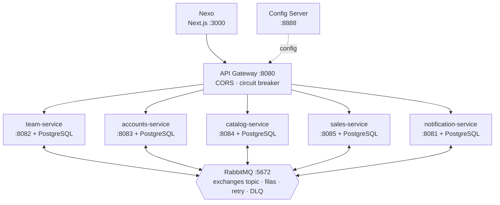
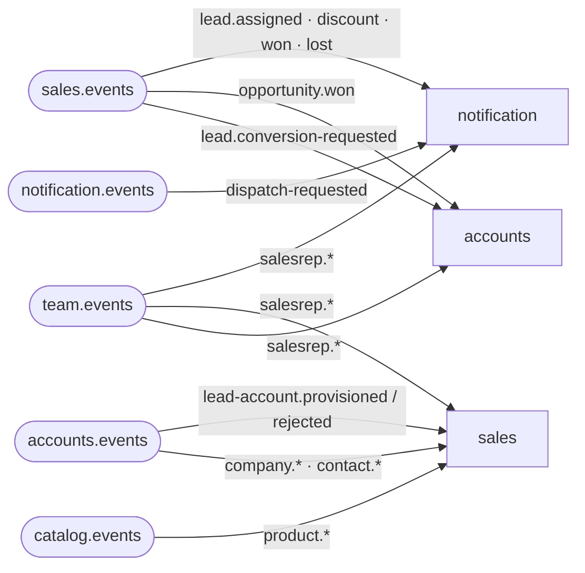

# Nexo CRM · TP4: Arquitetura orientada a eventos

CRM para uma empresa de TI , com leads, empresas, contatos, oportunidades, pipeline e notificações.
Nesta etapa o sistema foi dividido em microsserviços independentes.

---

## Como rodar

**Pré-requisitos:** JDK 21 · Docker Desktop · Node 20+ · IntelliJ IDEA

| # | Passo | Como |
|---|---|---|
| 1 | Subir RabbitMQ e os 5 bancos PostgreSQL | `docker compose up -d` |
| 2 | Instalar o frontend (só na primeira vez) | `cd frontend` e depois `npm install` |
| 3 | Subir tudo | IntelliJ → run configuration **`Todos os servicos`** |
| 4 | Carregar dados de exemplo (só na primeira vez) | IntelliJ → **`Carga inicial (seeder)`** |
| 5 | Usar | <http://localhost:3000> |

As run configurations ficam em `.run/` e o IntelliJ as reconhece ao abrir o `pom.xml` da raiz.
A carga inicial se ignora quando a base já tem dados. Para recomeçar do zero: `docker compose down -v` e depois `docker compose up -d`.

| Endereço | O que é |
|---|---|
| <http://localhost:3000> | Nexo (frontend) |
| <http://localhost:8080/api> | API Gateway |
| <http://localhost:15672> | RabbitMQ Management (`crm` / `crm`) |
| Tela **Plataforma** do Nexo | Saúde dos serviços, topologia, filas, DLQ e eventos ao vivo |

**Testes:** `./mvnw verify` (precisa do Docker, porque os testes sobem Postgres e RabbitMQ reais com Testcontainers).

---

## Diagrama da aplicação

```mermaid
flowchart TB
    UI["Nexo<br/>Next.js :3000"] --> GW["API Gateway :8080<br/>CORS · circuit breaker"]
    CFG["Config Server<br/>:8888"] -.config.-> GW

    GW --> TEAM["team-service<br/>:8082 + PostgreSQL"]
    GW --> ACC["accounts-service<br/>:8083 + PostgreSQL"]
    GW --> CAT["catalog-service<br/>:8084 + PostgreSQL"]
    GW --> SALES["sales-service<br/>:8085 + PostgreSQL"]
    GW --> NOTIF["notification-service<br/>:8081 + PostgreSQL"]

    TEAM <--> MQ{{"RabbitMQ :5672<br/>exchanges topic · filas · retry · DLQ"}}
    ACC <--> MQ
    CAT <--> MQ
    SALES <--> MQ
    NOTIF <--> MQ
```

### Quem publica e quem consome

```mermaid
flowchart LR
    T(["team.events"]) -->|salesrep.*| ACC["accounts"]
    T -->|salesrep.*| SALES["sales"]
    T -->|salesrep.*| NOTIF["notification"]

    C(["catalog.events"]) -->|product.*| SALES

    A(["accounts.events"]) -->|company.* · contact.*| SALES
    A -->|lead-account.provisioned / rejected| SALES

    S(["sales.events"]) -->|lead.conversion-requested| ACC
    S -->|opportunity.won| ACC
    S -->|lead.assigned · discount · won · lost| NOTIF

    N(["notification.events"]) -->|dispatch-requested| NOTIF
```

---

## Serviços

| Serviço | Porta | Responsabilidade | Publica em |
|---|---|---|---|
| **team-service** | 8082 | Vendedores, gestores e equipes | `team.events` |
| **accounts-service** | 8083 | Empresas (CNPJ) e contatos; vira a empresa em **cliente** quando uma oportunidade é ganha | `accounts.events` |
| **catalog-service** | 8084 | Produtos de software, hardware e serviços, com SKU, preço e desconto máximo | `catalog.events` |
| **sales-service** | 8085 | Leads com score, oportunidades com itens e MRR, aprovação de desconto, pipeline e atividades | `sales.events` |
| **notification-service** | 8081 | Caixa de entrada e e-mail (simulado) a partir dos eventos de vendas | `notification.events` |
| **api-gateway** | 8080 | Porta única da API, CORS, circuit breaker por rota e saúde agregada | — |
| **config-server** | 8888 | Configuração centralizada (Spring Cloud Config) | — |
| **crm-commons** | — | Biblioteca compartilhada: outbox, consumidor idempotente, retry/DLQ, auditoria e erros | — |
| **crm-seeder** | — | Carga inicial realista feita pela API do gateway | — |
| **frontend** | 3000 | Interface do Nexo | — |

---

## Decisões de arquitetura

- **Um banco por serviço.** Nenhum serviço lê a base de outro, e os dados de que precisa chegam por evento.
- **DDD em camadas** (`domain` · `application` · `infrastructure` · `api`), com domínio puro e sem dependência de Spring ou JPA.
- **Um exchange `topic` por serviço.** Cada consumidor cria a própria fila e assina só as routing keys de que precisa.
- **Transactional outbox.** O evento é gravado na mesma transação do dado e um relay publica no RabbitMQ com *publisher confirms*, então nenhum evento se perde.
- **Consumidor idempotente.** A tabela `processed_events` ignora mensagens repetidas.
- **Retry com atraso e DLQ.** Três filas de espera (5s, 30s e 2min) antes de a mensagem ir para a `.dlq`, de onde pode ser reprocessada pela tela Plataforma.
- **Réplicas locais por snapshot.** O sales-service tem cópias de vendedores, produtos, empresas e contatos para funcionar mesmo com os outros serviços fora do ar.
- **Saga coreografada** na conversão de lead, com compensação e timeout de 15 min.
- **Contratos de evento duplicados em cada serviço,** sem um módulo compartilhado de contratos, para não acoplar os deploys.
- **Resiliência no gateway.** Circuit breaker com resposta de fallback quando um serviço cai.

### Padrões de mensagem usados

| Padrão | Onde |
|---|---|
| Publish/subscribe | Eventos de `sales.events` consumidos ao mesmo tempo por accounts e notification |
| Event-carried state transfer | Réplicas de vendedores, produtos, empresas e contatos no sales-service |
| Saga coreografada (request/reply por eventos) | `sales.lead.conversion-requested` → `accounts.lead-account.provisioned` / `rejected` |
| Competing consumers (work queue) | `notification.dispatch`, com 2 a 6 workers enviando e-mails em paralelo |
| Retry + dead letter queue | Todas as filas de consumo (`.retry.1..3` e `.dlq`) |
| Transactional outbox | Todos os serviços produtores |

---

## EDA: prós e contras

| Prós | Contras |
|---|---|
| **Baixo acoplamento:** quem publica não conhece quem consome | **Consistência eventual:** os dados levam alguns instantes para chegar em todos os serviços |
| **Resiliência:** um serviço fora do ar não derruba os outros e as mensagens esperam na fila | **Depuração mais difícil:** o fluxo fica espalhado entre serviços e filas |
| **Escalabilidade:** é possível adicionar consumidores sem mudar o produtor | **Mais infraestrutura:** broker, filas de retry e DLQ para operar e monitorar |
| **Evolução:** um novo requisito vira um novo consumidor, sem alterar o que já existe | **Duplicidade e ordem:** é preciso tratar mensagens repetidas e fora de ordem |
| **Auditoria natural:** os eventos formam o histórico do que aconteceu | **Contratos de evento:** mudanças no formato exigem versionamento cuidadoso |
| **Absorve picos:** a fila segura a carga enquanto os consumidores processam | **Transações distribuídas:** exigem sagas e compensações em vez de um único commit |
