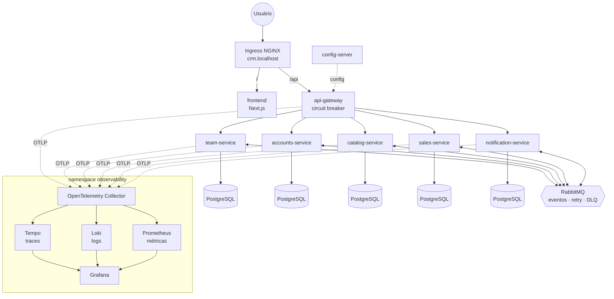

# Nexo CRM · TP5: Operação com Docker, Kubernetes e monitoramento

CRM B2B para uma empresa de TI, com leads, empresas, contatos, oportunidades, pipeline e notificações.
Microsserviços Spring Boot que se comunicam por eventos no RabbitMQ, rodando em containers orquestrados pelo Kubernetes, com logs e traces centralizados no Grafana.

---

## Endereços

| Endereço | O que é | Acesso |
|---|---|---|
| <http://crm.localhost> | Nexo, a aplicação | Escolha o usuário no topo da tela |
| <http://grafana.crm.localhost> | Grafana: dashboard, logs (Loki), traces (Tempo) e métricas (Prometheus) | Anônimo, ou `admin` / `admin` |
| <http://rabbitmq.crm.localhost> | RabbitMQ Management: exchanges, filas, retry e DLQ | `crm` / `crm` |

Os endereços são os mesmos no Kubernetes e no Docker Compose. Como `*.localhost` sempre aponta para a própria máquina, não é preciso editar o arquivo hosts.

---

## Como executar

**Pré-requisitos:** Docker Desktop, [kind](https://kind.sigs.k8s.io) e `kubectl`. Os scripts `.sh` rodam no Git Bash.

### Kubernetes (produção simulada)

| # | Comando | O que faz |
|---|---|---|
| 1 | `./k8s/scripts/cluster-up.sh` | Cria o cluster kind (1 control-plane + 2 workers) com Ingress NGINX e metrics-server |
| 2 | `./k8s/scripts/load-local-images.sh` | Opcional: builda as imagens locais. Sem ele, o cluster baixa as do Docker Hub |
| 3 | `./k8s/scripts/deploy.sh` | Sobe observabilidade, bancos, RabbitMQ, serviços, frontend e a carga inicial |
| 4 | `./k8s/scripts/smoke-test.sh` | Confere se tudo está no ar |

Para ver o autoscaling, rode `./k8s/scripts/load-test.sh` e acompanhe com `kubectl -n crm get hpa -w`.
Para apagar o cluster: `kind delete cluster --name nexo-crm`.

### Docker Compose

```bash
docker compose -f docker-compose.full.yml up -d --build
```

Sobe a mesma plataforma, com o Grafana, em containers. O Compose e o kind usam a porta 80, então rode um de cada vez.

### Desenvolvimento (IntelliJ)

`docker compose up -d` sobe só o RabbitMQ e os bancos. A run configuration **Todos os servicos** sobe os serviços e o frontend em <http://localhost:3000>.

---

## Arquitetura


```mermaid
flowchart TB
    U(("Usuário")) --> ING["Ingress NGINX<br/>crm.localhost"]
    ING -->|"/"| UI["frontend<br/>Next.js"]
    ING -->|"/api"| GW["api-gateway<br/>circuit breaker"]
    CFG["config-server"] -.config.-> GW

    GW --> TEAM["team-service"] --> DB1[("PostgreSQL")]
    GW --> ACC["accounts-service"] --> DB2[("PostgreSQL")]
    GW --> CAT["catalog-service"] --> DB3[("PostgreSQL")]
    GW --> SALES["sales-service"] --> DB4[("PostgreSQL")]
    GW --> NOTIF["notification-service"] --> DB5[("PostgreSQL")]

    TEAM & ACC & CAT & SALES & NOTIF <--> MQ{{"RabbitMQ<br/>eventos · retry · DLQ"}}

    subgraph OBS["namespace observability"]
        OTEL["OpenTelemetry Collector"] --> TEMPO["Tempo<br/>traces"]
        OTEL --> LOKI["Loki<br/>logs"]
        OTEL --> PROM["Prometheus<br/>métricas"]
        TEMPO & LOKI & PROM --> GRAF["Grafana"]
    end

    GW & TEAM & ACC & CAT & SALES & NOTIF -. OTLP .-> OTEL
```

| Serviço | Responsabilidade |
|---|---|
| **team-service** | Vendedores, gestores e equipes |
| **accounts-service** | Empresas e contatos; a empresa vira cliente quando uma oportunidade é ganha |
| **catalog-service** | Produtos de software, hardware e serviços |
| **sales-service** | Leads com score, oportunidades, pipeline e atividades |
| **notification-service** | Alertas comerciais e e-mails simulados |
| **api-gateway** | Entrada única da API, circuit breaker e saúde agregada |
| **config-server** | Configuração centralizada |

- **Um banco por serviço.** Os dados de outros serviços chegam por evento e ficam em réplicas locais.
- **Transactional outbox.** O evento é gravado junto com o dado e publicado no RabbitMQ com confirmação, carregando o contexto do trace.
- **Kubernetes:**
  - Bancos e RabbitMQ rodam em StatefulSets com volume.
  - Os serviços têm probes de saúde e rolling update sem indisponibilidade.
  - Gateway, sales, notification e frontend têm HPA de 2 a 5 réplicas por CPU.
- **Monitoramento:** o agent do OpenTelemetry instrumenta HTTP, banco e RabbitMQ sem código. O dashboard **Nexo CRM - Visão geral** mostra tráfego, erros, latência, JVM e filas. Do log se vai ao trace, e do trace aos logs.
- **CI/CD (GitHub Actions):**
  - O `ci.yml` roda build, testes com Testcontainers, cobertura, imagens e validação dos manifests.
  - O `cd.yml` publica as imagens no Docker Hub (`mariimariis/crm-*`), faz o deploy num cluster kind dentro do Actions e roda o smoke test.

**Testes:** `./mvnw verify` (precisa do Docker).
